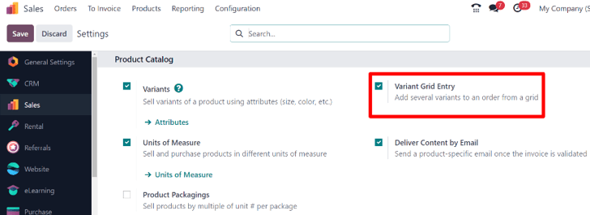
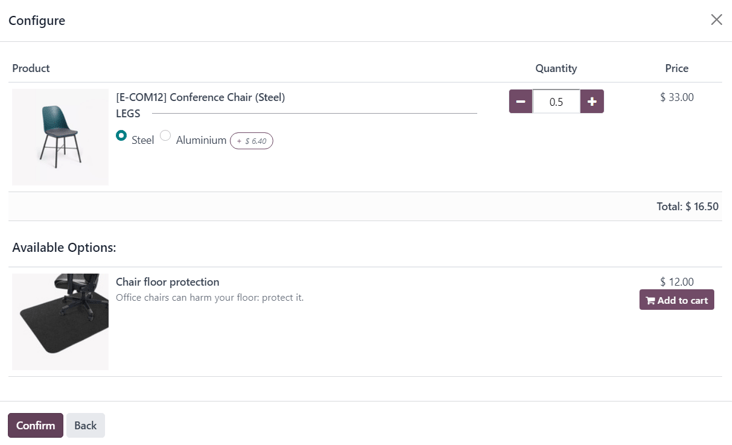
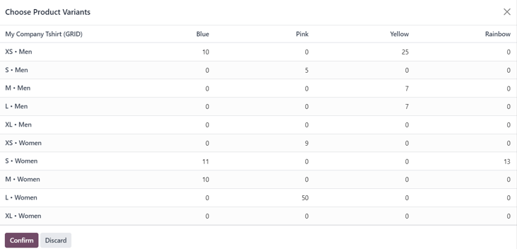
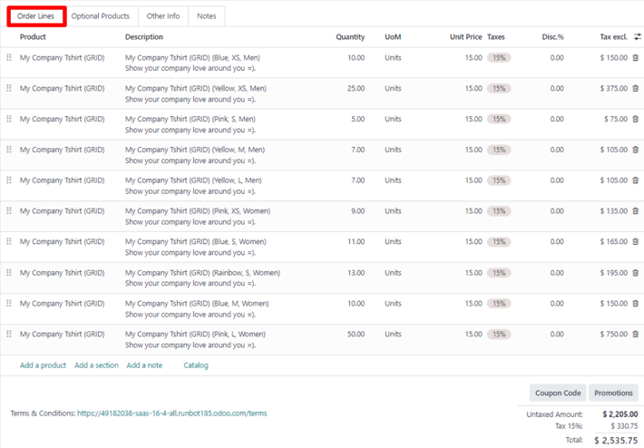

# Kotirovkalar va savdo buyurtmalarida mahsulot variantlari

Kotirovkalar va savdo buyurtmalarida mahsulot variantlarini qanday ishlatish haqida batafsil ma'lumotga kirishdan oldin Odoo'da `../products_prices/products/variants` haqida o'rganish tavsiya etiladi.

Mahsulot variantlari atrofidagi asoslar bilan tanishganingizdan so'ng, quyidagi qismda *mahsulot konfiguratori* yoki *buyurtma jadval kiritish* yordamida mahsulot variantlarini kotirovkalar va savdo buyurtmalariga qanday qo'shish mumkinligi yoritilgan.

::: tip

Shuni ta'kidlash kerakki, sozlama *Sales* ilova sozlamalari sahifasida *Variant Grid Entry* deb nomlangan va mahsulot formalarida *Order Grid Entry* deb nomlangan. Shuning uchun buni yodda saqlang.
::::

## Sozlamalar

Mahsulot variantlari bilan ishlashda Odoo sukut bo'yicha mahsulot konfiguratoridan foydalanadi. Variant jadval kiritish opsiyasini qo'shish uchun bu funksiya Odoo *Sales* ilovasida **majburiy ravishda** yoqilishi kerak. Variant jadval kiritish opsiyasi variant tanlash jarayonini soddalashtirish uchun kotirovka/savdo buyurtmasida qalqib chiquvchi oyna beradi.

Ushbu sozlamani yoqish uchun `Sales app ‣ Configuration ‣ Settings` ga o'ting va `Product Catalog` bo'limiga o'ting. Keyin `Variant Grid Entry` opsiyasining yonidagi katakchani belgilang va `Save` tugmasini bosing.

::: tip

Albatta, kotirovkalar va savdo buyurtmalarida mahsulot variantlarini ishlatish uchun `Variants` funksiyasi ham faollashtirilishi **shart**.
::::

## Mahsulot konfiguratsiyasi

`Variant Grid Entry` sozlamasi yoqilgandan so'ng, har bir mahsulot formasida ikkala variant (*Product Configurator* va *Order Grid Entry*) mavjud bo'ladi.

Mahsulot formasini mahsulot konfiguratori yoki variant jadval kiritishdan foydalanish uchun sozlash uchun ma'lumotlar bazasidagi barcha mahsulotlarni ko'rish uchun `Sales app ‣ Products ‣ Products` ga o'ting.

Keyin sozlash uchun kerakli mahsulotni tanlang yoki noldan yangi mahsulot yaratish uchun `New` tugmasini bosing. Mahsulot formasiga kirgandan so'ng, mahsulot variantlarini ko'rish, o'zgartirish va qo'shish mumkin bo'lgan `Attributes \& Variants` bo'limini bosing.

`Attributes \& Variants` bo'limining pastki qismida ikkita variant bilan `Sales Variant Selection` bo'limi mavjud: `Product Configurator` va `Order Grid Entry`.

::: tip

Shuni ta'kidlash kerakki, bu variantlar **faqat** yozuvga atributning kamida ikkita qiymati qo'shilganda paydo bo'ladi.
::::

Bu variantlar mahsulot variantlarini kotirovkalar yoki savdo buyurtmalariga qo'shishda qaysi usul ishlatilishini belgilaydi.

`Product Configurator` o'sha mahsulot kotirovkaga qo'shilganda o'sha mahsulot uchun mavjud bo'lgan barcha mahsulot variantlarini aniq ko'rsatadigan qalqib chiquvchi oyna beradi. Biroq, faqat bitta variant bir vaqtda tanlanishi/qo'shilishi mumkin.

`Order Grid Entry` `Product Configurator` bilan bir xil ma'lumotni jadval ko'rinishida beradi, bu esa foydalanuvchiga ko'proq noyob mahsulot variantlarini tanlash va ularni bitta ko'rinishda kotirovka/savdo buyurtmasiga qo'shish imkonini beradi.

## Mahsulot konfiguratori

Mahsulot konfiguratori funksiyasi (kamida ikkita) variantga ega mahsulot kotirovka yoki savdo buyurtmasiga qo'shilishi bilanoq `Configure` qalqib chiquvchi oynasi ko'rinishida paydo bo'ladi, lekin **faqat** mahsulot formasida `Product Configurator` opsiyasi tanlanган bo'lsa.

::: tip

Bu `Configure` qalqib chiquvchi oynasi `Order Grid Entry` sozlamasi **yoqilmagan** bo'lsa ham paydo bo'ladi, chunki bu Odoo kotirovkalar va/yoki savdo buyurtmalarida mahsulot variantlari bilan ishlashda ishlatiladigan sukut variant.
::::

`Product Configurator` opsiyasi sotuvchilarga onlayn xaridlarga o'xshash format yordamida kotirovka yoki savdo buyurtmasiga qaysi mahsulot variantini qo'shishni aniq tanlash imkonini beradi.

## Buyurtma jadval kiritish

Buyurtma jadval kiritish funksiyasi (kamida ikkita) variantga ega mahsulot kotirovka yoki savdo buyurtmasiga qo'shilishi bilanoq `Choose Product Variants` qalqib chiquvchi oynasi ko'rinishida paydo bo'ladi, lekin **faqat** mahsulot formasida `Order Grid Entry` opsiyasi tanlanган bo'lsa.

`Choose Product Variants` qalqib chiquvchi oynasida o'sha mahsulot uchun barcha variant variantlari mavjud. Ushbu qalqib chiquvchi oynadan sotuvchi bir vaqtning o'zida kotirovka/savdo buyurtmasiga qo'shmoqchi bo'lgan har bir variant miqdorini belgilashi mumkin.

Barcha kerakli miqdorlar va variantlar tanlanganidan so'ng, sotuvchi oddiygina `Confirm` tugmasini bosadi va bu buyurtmalar darhol `Order Lines` bo'limidagi kotirovka/savdo buyurtmasiga qo'shiladi.

