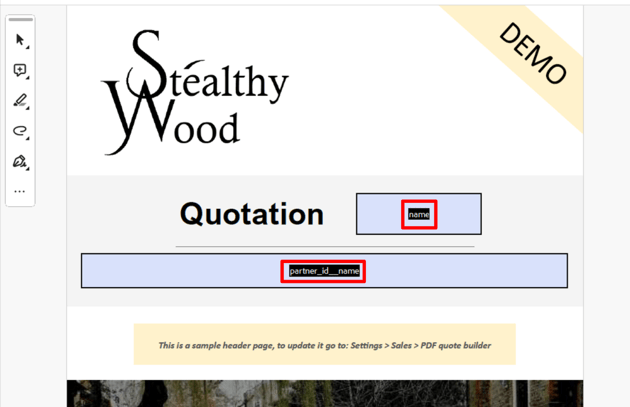
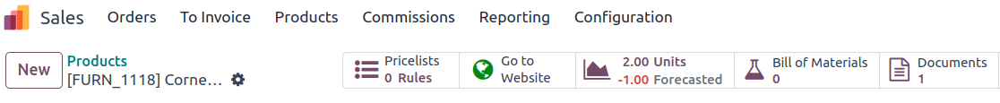
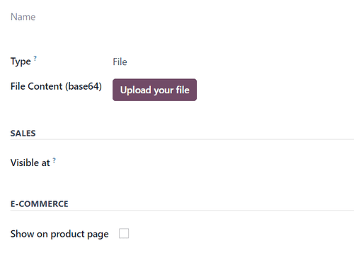
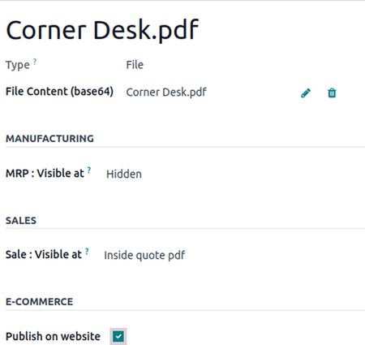
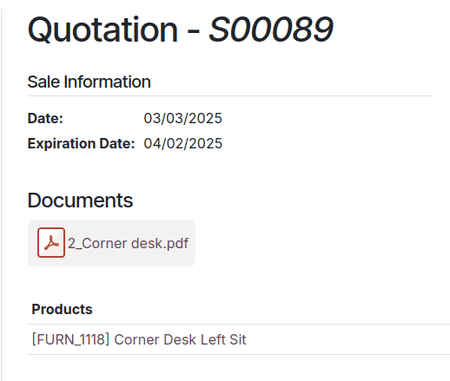
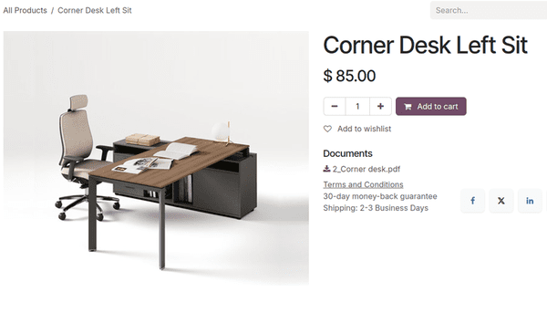
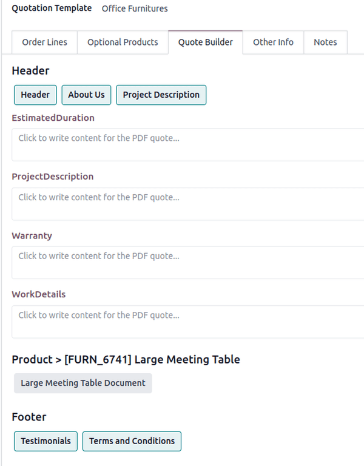
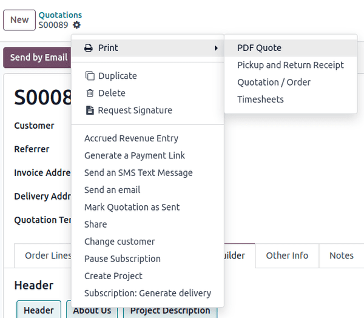

# PDF kotirovka quruvchi

Odoo *Sales* ilovasidagi *PDF Quote Builder* mijozlarga faqat narx va jami summani ko'rsatish o'rniga, turli ma'lumotlar va dizayn elementlari bilan kompaniya va mahsulotlarni namoyish etuvchi kotirovkalar uchun to'liq moslashtirilgan PDF fayl yuborish imkoniyatini beradi.

PDF Kotirovka Quruvchi batafsil kotirovka yaratish uchun sarlavha sahifalari, mahsulot tavsiflari, narx(lar) va oxirgi sahifalarni guruhlaydi. U shuningdek mijoz uchun taklifni shaxsiylashtirish uchun PDF ga dinamik matnlar yoki maxsus eslatmalarni kiritishi mumkin.

Kotirovkalarda moslashtirilgan PDF bo'lishi mijozlar uchun xarid tajribasining yuqori darajadagi yakunini beradi va kompaniyaga nafis professionallik darajasini qo'shadi.

::: tip

PDF formalarini Adobe dasturi bilan tahrirlash tavsiya etiladi. Sarlavha va oxirgi PDF shablonlaridagi forma maydonlari Odoo bilan dinamik qiymatlarni olish uchun zarur.
::::

## Konfiguratsiya

Kotirovkalar uchun maxsus PDF fayllarini qo'shish uchun `PDF Quote builder` funksiyasi *majburiy ravishda* sozlanishi kerak.

Buning uchun `Sales app ‣ Configuration ‣ Settings` ga o'ting. Keyin `Settings` sahifasida `Quotations & Orders` bo'limiga o'ting va `PDF Quote builder` funksiyasini toping.

## PDF ni Sarlavha/Oxirgi sifatida qo'shish

Odoo *Sales* da sarlavha yoki oxirgi qism sifatida ishlatilishi mumkin bo'lgan maxsus PDF qo'shish mumkin. PDF kotirovka quruvchi kotirovkada faollashtirilganda, siz kerakli miqdordagi sarlavha va oxirgi qismlarni tanlashingiz mumkin, bu PDF lar yakuniy PDF ga kiritiladi.

Maxsus PDF ni sarlavha yoki oxirgi qism sifatida qo'shish uchun `Sales app ‣ Configuration ‣ Headers/Footers` ga o'ting. Ushbu sahifadan `New` yoki `Upload` tugmasini bosing.

`Upload` tugmasini bosish darhol kerakli hujjatni yuklash imkoniyatini beradi. Keyin hujjat karta ustida yoki hujjat kartasining yuqori o'ng burchagidagi `fa-ellipsis-v` `(vertikal ellipsis)` belgisini bosib, keyin `Edit` tugmasini bosish orqali qo'shimcha sozlanishi mumkin.

`New` tugmasini bosish bo'sh hujjat formasini ochadi, unda kerakli PDF formaning `File Content` maydonida joylashgan `Upload your file` tugmasi orqali yuklanishi mumkin.

Yuklangan hujjat bilan bog'liq turli ma'lumotlar va konfiguratsiyalar bu yerda o'zgartirilishi mumkin.

Hujjat formasidagi birinchi maydon hujjatning `Name` uchun bo'lib, hujjat yuklanmaguncha kulrang (bosilmaydigan) bo'ladi. PDF yuklangandan so'ng `Name` maydoni PDF nomi bilan avtomatik to'ldiriladi va uni tahrirlash mumkin.

Keyin `Document Type` maydonida ochiluvchi menyuni bosing va ushbu fayllar kotirovkangizning boshida yoki oxirida tanlanishi mumkinligini belgilash uchun `Header` yoki `Footer` ni tanlang.

Buning ostida `Quotation Templates` bo'limida bu PDF faqat kotirovka shablonlari bilan cheklanishi mumkin.

::: tip

Shu bilan bir qatorda, `Sales app ‣ Configuration ‣ Quotation Templates` ga o'tish, shablon tanlash va `Quote Builder` bo'limida unga bevosita PDF `Add` yoki `Upload` qilish ham mumkin.
::::

Nihoyat, `File Content` maydoni yonida sizda `Configure dynamic fields` imkoniyati mavjud.

## PDF lardagi dinamik matn

Kotirovkalar uchun maxsus PDF lar yaratishda Odoo ma'lumotlar bazasidan kotirovka bilan bog'liq ma'lumotlar bilan PDF mazmunini avtomatik to'ldirishi uchun *dinamik matn* dan foydalaning, masalan, nomlar, narxlar va h.k.

Dinamik matn qiymatlari PDF faylga qo'shilishi mumkin bo'lgan forma komponentlari (matn kiritish) bo'lib, Odoo bu qiymatlarni kotirovka bilan bog'liq ma'lumotlar bilan avtomatik to'ldiradi.

### Dinamik matn qiymatlari

Quyida maxsus PDF larda ishlatiladigan va to'g'ri maydanlarga moslashtirilgan hamda ular nimani ifodalashini ko'rsatuvchi umumiy dinamik matn qiymatlari keltirilgan.

Sarlavha va oxirgi PDF lar uchun:

- `name`: Savdo buyurtmasi havolasi
- `partner_id__name`: Mijoz nomi
- `user_id__name`: Sotuvchi nomi
- `amount_untaxed`: Soliqsiz summa
- `amount_total`: Jami summa
- `delivery_date`: Yetkazib berish sanasi
- `validity_date`: Amal qilish muddati
- `client_order_ref`: Mijoz havolasi

Mahsulot PDF uchun:

- `description`: Mahsulot tavsifi
- `quantity`: Miqdor
- `uom`: O'lchov birligi (UoM)
- `price_unit`: Birlik narxi
- `discount`: Chegirma
- `product_sale_price`: Mahsulot ro'yxat narxi
- `taxes`: Vergul bilan birlashtirilgan soliq nomlari ([,])
- `tax_excl_price`: Soliqsiz narx
- `tax_incl_price`: Soliq kiritilgan narx

PDF yuklangandan so'ng `Configure dynamic fields` ni amalga oshirishingiz mumkin. Bu sizga PDF ingizda topilgan har qanday maydon nomini mavjud yo'lni yozish orqali ko'rsatmoqchi bo'lgan maydonga moslashtirish imkonini beradi. Sarlavha va oxirgi qismlar joriy `sale_order` modelidan boshlanadi, mahsulot hujjati esa o'z yo'lini `sale_order_line` dan kuzatib boradi. Bu yo'lni bo'sh qoldirish sizga uni talab qiladigan muayyan kotirovkadan bevosita maxsus eslatmalarni to'ldirish imkonini beradi.

::: tip
PDF qurilganda umumiy dinamik matn qiymatlaridan (`name` va `partner_id_name`) foydalanish eng yaxshi amaliyotdir. Ma'lumotlar bazasiga yuklanganda Odoo bu maydonlarni tegishli maydonlardan olingan ma'lumotlar bilan avtomatik to'ldiradi.

Bu holda Odoo `name` dinamik matn maydonida Savdo buyurtmasi havolasini va `partner_id_name` maydonida Mijoz nomini avtomatik to'ldiradi.

:::

PDF fayl(lar) tayyor bo'lgandan so'ng ularni kompyuterning qattiq diskiga saqlang va `Sales app ‣ Configuration ‣ Headers/Footers` orqali Odoo ga yuklashni davom eting.

::: tip
Savdo buyurtmasida mavjud ma'lumot bo'lgan `invoice_partner_country` forma maydonini o'z ichiga olgan PDF yuklashda `Form Field Name` ning `path` ini quyidagicha sozlang: - sarlavha yoki oxirgi hujjat uchun `partner_invoice_id.country_id.name` - mahsulot hujjati uchun `order_id.partner_invoice_id.country_id.name` PDF qurilganda formani hisob-faktura hamkor mamlakati nomi bilan to'ldiradi.
:::

::: tip
`custom_note` forma maydonini o'z ichiga olgan har qanday PDF yuklashda `path` ni bo'sh qoldirish sotuvchiga o'sha hujjatda forma maydoni joylashgan va PDF qurilganda ko'rsatiladigan har qanday eslatma yozish imkonini beradi.
:::

## Mahsulotga PDF qo'shish

Odoo *Sales* da mahsulot formasiga maxsus PDF qo'shish ham mumkin. PDF mahsulotga qo'shilganda va o'sha mahsulot kotirovkada ishlatilganda, o'sha PDF ham yakuniy PDF ga kiritiladi.

Mahsulotga maxsus PDF qo'shish uchun `Sales app ‣ Products ‣ Products` ga o'ting va maxsus PDF qo'shmoqchi bo'lgan kerakli mahsulotni tanlang.

::: tip

Hujjat mahsulot o'rniga mahsulot variantiga ham qo'shilishi mumkin. Agar mahsulot *va* uning variantida hujjatlar bo'lsa, **faqat** variantdagi hujjatlar ko'rsatiladi.

Mahsulot variantiga maxsus hujjat qo'shish uchun `Sales app ‣ Products ‣ Product Variants` ga o'ting. Kerakli variantni tanlang, `Documents` smart tugmasini bosing va muayyan mahsulot variantiga maxsus hujjatni yuklashni davom eting.
::::

Mahsulot sahifasida o'sha mahsulot uchun `Documents` sahifasiga o'tish uchun sahifaning yuqori qismidagi `Documents` smart tugmasini bosing, bu yerda mahsulot bilan bog'liq fayllar yuklanishi mumkin. Ushbu sahifadan `New` yoki `Upload` tugmasini bosing.

`Upload` tugmasini bosish kompyuterning mahalliy fayl katalogini ochadi. Yuklangan hujjat karta ustida yoki hujjat kartasining yuqori o'ng burchagidagi `fa-ellipsis-v` `(vertikal ellipsis)` belgisini bosib, keyin `Edit` tugmasini bosish orqali qo'shimcha sozlanishi mumkin.

`New` tugmasini bosish bo'sh hujjat formasini ochadi, unda kerakli PDF formaning `File Content` maydonida joylashgan `Upload your file` tugmasi orqali yuklanishi mumkin.

### PDF forma konfiguratsiyasi

Hujjat formasidagi birinchi maydon hujjatning `Name` uchun bo'lib, hujjat yuklanmaguncha kulrang (bosilmaydigan) bo'ladi. PDF yuklangandan so'ng `Name` maydoni PDF nomi bilan avtomatik to'ldiriladi va uni tahrirlash mumkin.

Hujjat yuklashdan oldin `Type` ochiluvchi maydon menyusidan hujjat `File` yoki `URL` ekanligini belgilash opsiyasi mavjud.

::: tip

Agar PDF yuklangan bo'lsa, `Type` maydoni avtomatik ravishda `File` ga to'ldiriladi va uni o'zgartirib bo'lmaydi.
::::

Keyin `Sales` bo'limida `Visible at` maydonida ochiluvchi menyuni bosing va quyidagilardan birini tanlang: `On quotation`, `On confirmed order` yoki `Inside quote pdf`.

- `Quotation`: hujjat mijozlarga istalgan vaqtda yuboriladi (va ularga ochiq bo'ladi).
- `Confirmed order`: hujjat buyurtma tasdiqlanganida mijozlarga yuboriladi. Bu foydalanuvchi qo'llanmalari va boshqa qo'shimcha hujjatlar uchun eng yaxshisi.
- `Inside quote`: hujjat kotirovka PDF iga, sarlavha sahifalari va kotirovkaning `Pricing` bo'limi orasida kiritiladi.

::: tip
`Visible at` maydoni uchun `Inside quote` opsiyasi tanlanganida va maxsus PDF fayl [Corner Desk.pdf] yuklanganda, PDF *mijoz portalida* kotirovkada `Documents` maydoni ostida ko'rinadi.

:::

`File Content` maydoni yonida sizda `Configure dynamic fields` imkoniyati mavjud. Buni amalga oshirishda boshlanish modeli `sale_order_line` ekanligini eslang, `sale_order` dan boshlanadigan sarlavha va oxirgi qismlardan farqli o'laroq.

Nihoyat, `E-Commerce` bo'limida PDF onlayn do'konda mahsulot sahifasida paydo bo'lishi uchun `Publish on Website` ni yoqish yoki yoqmaslikni hal qiling.

::: tip
`Publish on Website` opsiyasi yoqilganida yuklangan hujjatga [Corner Desk.pdf] havola onlayn do'kondagi mahsulot sahifasida paydo bo'ladi.

U `Documents` sarlavhasi ostida yuklangan hujjat nomini ko'rsatuvchi havola bilan paydo bo'ladi.

> 
:::

## PDF kotirovka

Savdo buyurtmasida `Quote Builder` bo'limida yakuniy PDF ga birlashtirilishi kerak bo'lgan qo'shimcha hujjatlarni tanlang. Agar tanlangan hujjatda maxsus maydonlar bo'lsa, ular to'ldirilishi kerak bo'lgan tahrirlanadigan matn qutilari sifatida paydo bo'ladi.

Oldindan sozlangan PDF bilan kotirovka tasdiqlanganidan so'ng, Odoo xatolarni tekshirish yoki yozuvlar uchun saqlash uchun tasdiqlangan kotirovkani chop etish opsiyasini beradi.

PDF kotirovkani chop etish uchun tasdiqlangan kotirovkaga o'ting va ochiluvchi menyuni ochish uchun `⚙️ (gear)` belgisini bosing. Ushbu ochiluvchi menyudan `Print` ni tanlang, keyin `PDF Quote` ni tanlang.

Buni amalga oshirish PDF kotirovkani darhol yuklab oladi. Ochilganda PDF kotirovka va kotirovka ichida ko'rinadigan qilib sozlangan mahsulot PDF ni ko'rish va chop etish mumkin.

::: tip

Qo'shimcha ma'lumot uchun ushbu `PDF quote builder examples` ni yuklab oling yoki `sample quotation` ni yuklab oling.
::::