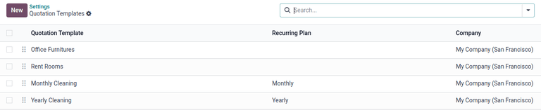

# Kotirovka shablonlari

Umumiy mahsulotlar yoki xizmatlar uchun Odoo'ning **Sales** ilovasida qayta foydalaniladigan kotirovka shablonlarini yaratish mumkin.

Ushbu shablonlardan foydalanib, kotirovkalarni mijozlarga tezroq moslashtirib yuborish mumkin, har safar savdo muzokaralari paytida yangi kotirovkalarni noldan yaratish shart emas.

## Sozlash

Kotirovka shablonlaridan foydalanish uchun avval `Sales app ‣
Configuration ‣ Settings` bo'limida sozlamani faollashtiring va `Quotations &_Orders` sarlavhasigacha pastga suring.

Sarlavha ostida `Quotation Templates` katakchani belgilang. Buni qilish yangi `Default Template` maydonini ochadi, bu yerda ochiladigan menyudan standart kotirovka shablonini tanlash mumkin.

`Quotation Template` funksiyasini faollashtirganingizdan so'ng, `Default Template` maydoni ostida ichki `fa-arrow-right` `Quotation Templates` havolasi paydo bo'ladi.

Ushbu havolani bosish `Quotation Templates` sahifasini ochadi, bu yerda shablonlarni yaratish, ko'rish va tahrirlash mumkin.

`Settings` sahifasini tark etishdan oldin, sessiya davomida qilingan barcha o'zgarishlarni saqlash uchun `Save` tugmasini bosishni unutmang.

## Kotirovka shablonlarini yaratish

Kotirovka shablonini yaratish uchun `Quotation templates` yoqilgach `Settings` sahifasidagi `Quotation Templates` havolasini bosing yoki `Sales app ‣ Configuration ‣ Quotation Templates`ga o'ting. Ikkala variant ham `Quotation Templates` sahifasini ochadi, bu yerda kotirovka shablonlarini yaratish, ko'rish va tahrirlash mumkin.

Yangi kotirovka shablonini yaratish uchun yuqori chap burchakda joylashgan `New` tugmasini bosing. Bu sozlanishi mumkin bo'lgan bo'sh kotirovka shabloni formasini ochadi.

Avval `Quotation Template` maydoniga shablon uchun nom kiriting.

Keyin `Quotation Validity` maydonida kotirovka shabloni necha kun amal qilishini ko'rsating yoki shablonni cheksiz muddatga amal qilishi uchun maydonni standart [0] da qoldiring.

Keyingi `Confirmation Mail` maydonida buyurtma tasdiqlanganda mijozlarga yuboriladigan oldindan sozlangan elektron pochta shablonini tanlash uchun bo'sh ochiladigan menyuni bosing.

::: tip

`Confirmation Mail` maydonidan to'g'ridan-to'g'ri yangi elektron pochta shablonini yaratish uchun maydonda yangi elektron pochta shablonining nomini yozishni boshlang va paydo bo'ladigan ochiladigan menyudan `Create` yoki `Create and edit...` variantlaridan birini tanlang.

`Create` ni tanlash elektron pochta shablonini yaratadi, uni keyinroq tahrirlash mumkin.

`Create and edit...` ni tanlash elektron pochta shablonini yaratadi va `Create Confirmation Mail` pop-up oynasi paydo bo'ladi, bu yerda elektron pochta shablonini darhol sozlash va konfiguratsiya qilish mumkin.

Barcha o'zgarishlar tugallangach, elektron pochta shablonini saqlash va kotirovka formasiga qaytish uchun `Save & Close` ni bosing.
::::

Agar ko'p kompaniyali muhitda ishlayotgan bo'lsangiz, ushbu kotirovka shabloni qaysi kompaniyaga tegishli ekanligini ko'rsatish uchun `Company` maydonidan foydalaning.

Agar `Invoicing Journal` maydonida jurnal o'rnatilgan bo'lsa, ushbu shablon bilan barcha savdo buyurtmalari o'sha belgilangan jurnalda hisob-faktura beriladi. Agar bu maydon bo'sh bo'lsa, eng past ketma-ketlikka ega savdo jurnali ishlatiladi.

Agar `Settings` da (`Sales app ‣ Configuration ‣ Settings`) `Online Signature` va/yoki `Online Payment` funksiyalari faollashtirilgan bo'lsa, bu variantlar kotirovka shabloni formalarida mavjud bo'ladi.

Buyurtmani tasdiqlash uchun mijozdan onlayn imzo so'rash uchun `Online Signature` yonidagi katakchani belgilang.

Buyurtmani tasdiqlash uchun mijozdan onlayn to'lov so'rash uchun `Online Payment` yonidagi katakchani belgilang. `Online Payment` belgilanganda yangi foiz maydoni paydo bo'ladi, bu yerda ma'lum bir to'lov foizini kiritish mumkin.

Ikkala variant, `Online Signature` va `Online Payment` bir vaqtda yoqilishi mumkin, bu holda mijoz buyurtmani tasdiqlash uchun **ham** imzo **ham** to'lovni taqdim etishi kerak.

`Recurring Plan` maydonida ushbu kotirovka shabloni qanchalik tez-tez takrorlanishini ko'rsatish uchun turli xil oldindan sozlangan vaqt miqdorlaridan (`Monthly`, `Quarterly` va boshqalar) tanlang.

::: tip

`Recurring Plan` maydoni **faqat** obuna rejalariga tegishli. Qo'shimcha ma'lumot uchun `../../subscriptions/plans` bo'yicha hujjatlarni ko'ring.
::::

### Lines bo'limi

`Lines` bo'limida `Add a product` ni bosib kotirovka shabloniga mahsulotlar qo'shish, `Add a section` ni bosib tartibga solish (va bo'lim sarlavhalarini sudrab olib tashlash) va `Add a note` ni bosib ixtiyoriy ma'lumotlar (kafolat tafsilotlari, shartlar va boshqalar) bilan qo'shimcha tushuntirish mumkin.

Kotirovka shabloniga mahsulot qo'shish uchun kotirovka shabloni formasining `Lines` bo'limida `Add a product` ni bosing. Bu `Product` ustunida bo'sh maydonni ochadi.

Bosilganda ma'lumotlar bazasidagi mavjud mahsulotlar bilan ochiladigan menyu paydo bo'ladi. Kotirovka shabloniga qo'shish uchun ochiladigan menyudan kerakli mahsulotni tanlang.

Agar kerakli mahsulot darhol ko'rinmasa, `Product` maydoniga kerakli mahsulot nomini yozing va variant ochiladigan menyuda paydo bo'ladi. Mahsulotlarni ochiladigan menyudan `Search More...` ni bosib ham topish mumkin.

::: tip

Kotirovka shablonlariga tadbir bilan bog'liq mahsulotlarni (stendlar va ro'yxatga olishlar) qo'shish mumkin. Buning uchun `Product` maydonini bosing, [Event] ni yozing va kerakli tadbir bilan bog'liq mahsulotni natijada paydo bo'ladigan ochiladigan menyudan tanlang.
::::

::: tip

Mahsulot kotirovka shabloniga qo'shilganda standart `Quantity` [1] bo'ladi, lekin uni istalgan vaqtda tahrirlash mumkin.
::::

Keyin mahsulotni har bir qator elementining chap tomonida joylashgan `six squares` belgisi orqali kerakli joyga sudrab olib tashlang.

Savdo buyurtmasi qatorlarini tartibga solish uchun sarlavha vazifasini bajaradigan *bo'limni* qo'shish uchun `Lines` bo'limida `Add a section` ni bosing. Bosilganda bo'sh maydon paydo bo'ladi, bu yerda bo'limning kerakli nomini yozish mumkin. Nom kiritilgach, bo'lim nomini saqlash uchun boshqa joyni bosing.

Keyin bo'lim nomini har bir qator elementining chap tomonida joylashgan `oi-apps` `(six squares)` belgisi orqali kerakli joyga sudrab olib tashlang.

Kotirovkada mijoz uchun matn ko'rinishida paydo bo'ladigan eslatmani qo'shish uchun `Lines` bo'limida `Add a note` ni bosing. Bosilganda bo'sh maydon paydo bo'ladi, bu yerda kerakli eslatmani yozish mumkin. Eslatma kiritilgach, eslatmani saqlash uchun boshqa joyni bosing.

Keyin eslatmani `oi-apps` `(six squares)` belgisi orqali kerakli joyga sudrab olib tashlang.

`Lines` bo'limidan har qanday qator elementini (mahsulot, bo'lim va/yoki eslatma) o'chirish uchun qatorning o'ng tomonidagi `fa-trash` `(remove record)` belgisini bosing.

### Optional Products bo'limi

*Ixtiyoriy mahsulotlar* dan foydalanish asosiy mahsulot bilan birga mahsulotlarni o'zaro sotishni o'z ichiga olgan marketing strategiyasidir. Maqsad mijozlarga foydali va bog'liq mahsulotlarni taklif qilish bo'lib, bu sotuvni oshirishi mumkin.

::: tip
Agar mijoz mashina sotib olmoqchi bo'lsa, u mashinani to'ldiruvchi qo'shimcha mahsulot sifatida massaj o'rindiqlari buyurtma qilishni tanlashi yoki taklifni rad etib faqat mashinani sotib olishi mumkin.
:::

Ixtiyoriy mahsulotlar savdo buyurtmalarining pastki qismida va elektron tijorat sahifalarida bo'lim sifatida paydo bo'ladi. Mijozlar xohlasa, ularni onlayn savdo buyurtmalariga darhol qo'sha olishadi.

`Optional Products` bo'limida agar kerak bo'lsa, `Lines` bo'limidagi asl elementlar bilan bog'liq har bir o'zaro sotuv mahsuloti uchun `Add a line` qo'shing.

`Add a line` ni bosish `Product` ustunida bo'sh maydonni ochadi.

Bosilganda ma'lumotlar bazasidan mahsulotlar bilan ochiladigan menyu paydo bo'ladi. Kotirovka shabloniga ixtiyoriy mahsulot sifatida qo'shish uchun ochiladigan menyudan kerakli mahsulotni tanlang.

`Optional Products` bo'limidan har qanday qator elementini o'chirish uchun `fa-trash` `(remove record)` belgisini bosing.

::: tip

Kotirovka shablonini yaratish uchun ixtiyoriy mahsulotlar **talab qilinmaydi**.
::::

### Terms & Conditions bo'limi

`Terms & Conditions` bo'limi kotirovka shabloniga shart-sharoitlarni qo'shish imkoniyatini beradi. Shart-sharoitlarni qo'shish uchun ushbu bo'limda kerakli shart-sharoitlarni yozing.

::: tip

Kotirovka shablonini yaratish uchun shart-sharoitlar **talab qilinmaydi**.
::::

## Kotirovka shablonlaridan foydalanish

Kotirovka yaratayotganda (`Sales app ‣ New`) `Quotation Template` maydonida oldindan sozlangan shablonni tanlang.

::: tip

`Quotation Template` maydonidagi shablonlar tartibi Quotation Templates formasidagi shablonlar tartibiga bog'liq. Quotation Templates formasidagi kotirovkalar tartibi boshqa hech narsaga ta'sir qilmaydi.
::::

Mijoz nimani ko'rishini ko'rish uchun sahifaning yuqori qismidagi `Preview` tugmasini bosing va kotirovka shabloni Odoo'ning mijoz portali orqali veb-saytning old qismida qanday ko'rinishini ko'ring.

Barcha bloklar va sozlamalar tugallangach, konfiguratsiyani saqlash uchun `Save` tugmasini bosing.

Kotirovka shabloni ko'rinishining yuqori qismida joylashgan ko'k banner tez qaytish uchun `fa-arrow-right` `Back to edit mode` dan foydalanish mumkin. Bosilganda Odoo *Sales* ilovasining orqa qismidagi kotirovka formasiga qaytadi.

## Kotirovkalar/savdo buyurtmalarini ommaviy bekor qilish

`Sales app ‣ Orders ‣ Quotations` panelining ko'rinishiga o'tib, standart ravishda ro'yxat ko'rinishida bir nechta kotirovkalarni (yoki savdo buyurtmalarini) bekor qiling. Keyin jadvalning chap tomonida bekor qilinadigan kotirovkalar uchun katakchalarni belgilang.

::: tip

Jadvalning yuqori chap qismidagi ustun sarlavhasi katakchasini tanlash orqali jadvaldagi barcha yozuvlarni tanlang; tanlangan elementlarning umumiy soni sahifaning yuqori qismida ko'rsatiladi.
::::

Keyin `Quotations` sahifasidagi ro'yxat ko'rinishidan kerakli kotirovkalar (yoki savdo buyurtmalari) tanlangan holda, ochiladigan menyuni ochish uchun `fa-cog` `Actions` tugmasini bosing.

Ushbu ochiladigan menyudan `Cancel quotations` ni tanlang.

::: tip

Bu amal *har qanday* bosqichdagi kotirovkalar uchun, hatto savdo buyurtmasi sifatida tasdiqlangan bo'lsa ham amalga oshirilishi mumkin.
::::

`Cancel quotations` variantini tanlaganda `Cancel quotations` tasdiqlash pop-up oynasi paydo bo'ladi. Bekor qilishni yakunlash uchun `Cancel quotations` tugmasini bosing.

::: tip

Hisob-fakturasi bo'lgan davom etayotgan obuna uchun buyurtmani bekor qilishga urinayotganda xato pop-up xabari paydo bo'ladi.
::::