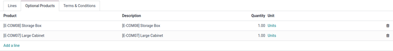
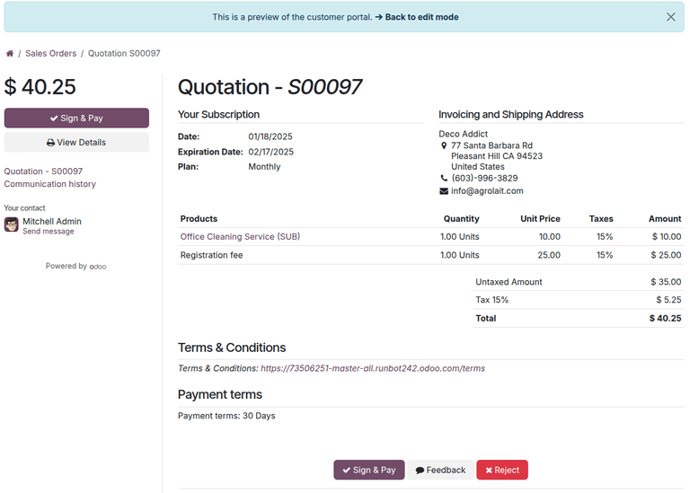
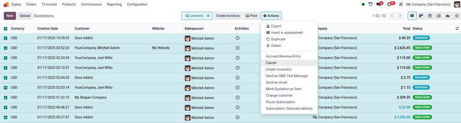

# Taklifnoma shablonlari

Odoo’ning **Savdo** ilovasida umumiy mahsulotlar yoki xizmatlar uchun qayta ishlatiladigan *taklifnoma shablonlari*
yaratish mumkin.

Bu shablonlardan foydalanish orqali har safar yangi savdo muzokarasi yuz berganida taklifnomani boshqatdan yaratishga
hojat qolmaydi. Taklifnomalar tezroq va moslashtirilgan holda mijozlarga yuboriladi.

## Sozlamalar

Taklifnoma shablonlaridan foydalanish uchun quyidagi sozlamani yoqing:

`Savdo ilovasi ‣ Konfiguratsiya ‣ Sozlamalar` bo‘limiga o‘ting va `Taklifnomalar va Buyurtmalar` sarlavhasi ostiga
pastga tushing.

Shu sarlavha ostidan `Taklifnoma shablonlari` (`Quotation Templates`) belgisi (checkbox) ni belgilang. Buni amalga
oshirgach, yangi `Standart shablon` (`Default Template`) maydoni paydo bo‘ladi. Ushbu maydondan ochiluvchi ro‘yxat
orqali standart taklifnoma shablonini tanlash mumkin.

`Taklifnoma shablonlari` funksiyasi faollashtirilgach, `Standart shablon` maydoni ostida ichki `Taklifnoma shablonlari`
sahifasiga olib boruvchi `→` havola (`Quotation Templates` link) paydo bo‘ladi.

Ushbu havolani bosganingizda `Taklifnoma shablonlari` sahifasi ochiladi. Bu sahifada shablonlarni yaratish, ko‘rish va
tahrirlash mumkin.

`Sozlamalar` sahifasidan chiqishdan oldin, sessiya davomida kiritilgan barcha o‘zgarishlarni saqlash uchun `Saqlash` (
`Save`) tugmasini bosishni unutmang.

## Taklifnoma shablonlarini yaratish

Taklifnoma shabloni yaratish uchun, `Taklifnoma shablonlari` (`Quotation Templates`) sozlamasi yoqilgach, `Sozlamalar`
sahifasidagi `Taklifnoma shablonlari` havolasini bosing yoki quyidagi yo‘ldan o‘ting:  
`Savdo ilovasi ‣ Konfiguratsiya ‣ Taklifnoma shablonlari`.

Har ikkala yo‘l ham sizni `Taklifnoma shablonlari` sahifasiga olib boradi. Bu yerda shablonlarni yaratish, ko‘rish va
tahrirlash mumkin.

Yangi shablon yaratish uchun yuqori chapdagi `Yangi` (`New`) tugmasini bosing. Bunda sizga sozlanadigan bo‘sh taklifnoma
shabloni shakli taqdim etiladi.

Avvalo, `Taklifnoma shabloni` (`Quotation Template`) maydoniga shablon nomini kiriting.

So‘ng `Taklifnoma amal qilish muddati` (`Quotation Validity`) maydoniga bu shablon necha kun amal qilishini kiriting.
Agar bu maydonni [0] holatda qoldirsangiz, shablon doimiy amal qiladi.

Keyingi `Tasdiqlash xati` (`Confirmation Mail`) maydonida ochiluvchi ro‘yxatdan buyurtma tasdiqlangach mijozga
yuboriladigan oldindan tayyorlangan email shablonini tanlang.

::: tip

Yangi email shablonini bevosita `Tasdiqlash xati` maydonidan yaratish uchun, maydonga yangi shablon nomini yozing va
ochiluvchi menyudan `Yaratish` (`Create`) yoki `Yaratish va tahrirlash...` (`Create and edit...`) ni tanlang.

- `Yaratish` — shablonni yaratadi va uni keyinchalik tahrirlash mumkin.
- `Yaratish va tahrirlash...` — email shablonini yaratadi va darhol ochiladigan `Tasdiqlash xatini yaratish` oynasi
  orqali sozlash imkonini beradi.

Tahrir tugagach, `Saqlash va yopish` (`Save & Close`) tugmasini bosing va taklifnoma formasiga qayting.
:::

Agar siz ko‘p kompaniyali muhitda ishlayotgan bo‘lsangiz, `Kompaniya` (`Company`) maydoni orqali ushbu shablon qaysi
kompaniyaga tegishli ekanini ko‘rsating.

Agar `Hisob jurnal` (`Invoicing Journal`) maydoni to‘ldirilgan bo‘lsa, ushbu shablon asosida yaratilgan barcha savdo
buyurtmalari shu jurnalga asoslangan holda hisob-faktura chiqaradi. Agar jurnal belgilanmasa, eng past tartibdagi jurnal
ishlatiladi.

Agar `Sozlamalar` (`Savdo ilovasi ‣ Konfiguratsiya ‣ Sozlamalar`) bo‘limida *Onlayn imzo* yoki *Onlayn to‘lov*
funksiyalari yoqilgan bo‘lsa, bu variantlar taklifnoma shabloni formasida ham mavjud bo‘ladi:

- `Onlayn imzo` belgisini belgilang — bu mijozdan buyurtmani tasdiqlash uchun imzo so‘rash imkonini beradi.
- `Onlayn to‘lov` belgisini belgilang — mijozdan oldindan to‘lov so‘raladi. Belgilanganidan so‘ng, foiz maydoni paydo
  bo‘ladi va to‘lanishi kerak bo‘lgan foizni kiritish mumkin.

Agar ikkala opsiya birgalikda yoqilgan bo‘lsa, mijoz buyurtmani tasdiqlash uchun **ham imzo**, **ham to‘lov** taqdim
etishi kerak bo‘ladi.

`Takrorlanuvchi rejalar` (`Recurring Plan`) maydonida oldindan sozlangan davrlarni tanlang (masalan, `Oylik`,
`Har chorakda`, va h.k.), bu orqali taklifnoma shabloni qanchalik tez-tez takrorlanishini belgilaysiz.

::: tip
`Takrorlanuvchi rejalar` maydoni **faqat** obuna rejalariga tegishli. Batafsil ma’lumot uchun qarang:
`../../subscriptions/plans`.
:::

### Qatorlar tab

`Qatorlar` (`Lines`) tabida mahsulotlarni taklifnoma shabloniga qo‘shish mumkin. Buning uchun `Mahsulot qo‘shish` (
`Add a product`) tugmasini bosing, `Bo‘lim qo‘shish` (`Add a section`) orqali tartiblang va `Izoh qo‘shish` (
`Add a note`) orqali qo‘shimcha ma’lumot (masalan, kafolat, shartlar va boshqalar) kiriting.

Mahsulot qo‘shish uchun, `Qatorlar` tabida `Mahsulot qo‘shish` tugmasini bosing. Shunda `Mahsulot` ustunida bo‘sh maydon
ochiladi.

Bu maydonga bosganingizda, bazadagi mavjud mahsulotlar ro‘yxati chiqadi. Kerakli mahsulotni ro‘yxatdan tanlang.

Agar kerakli mahsulot ro‘yxatda ko‘rinmasa, mahsulot nomini `Mahsulot` maydoniga yozing — kerakli variant ochiluvchi
menyuda paydo bo‘ladi. Shuningdek, `Ko‘proq izlash...` (`Search More...`) tugmasini bosib mahsulotlarni topish mumkin.

::: tip

Taklifnoma shablonlariga tadbirlarga oid mahsulotlar (masalan, stendlar va ro‘yxatdan o‘tishlar) ham qo‘shilishi mumkin.
Buning uchun `Mahsulot` maydoniga [Tadbir] (`Event`) deb yozing va kerakli mahsulotni tanlang.

:::

::: tip

Taklifnoma shabloniga mahsulot qo‘shilganda, odatiy `Miqdor` (`Quantity`) qiymati [1] bo‘ladi. Uni istalgan vaqtda
o‘zgartirish mumkin.

:::

Qo‘shilgan mahsulotni kerakli tartibga joylashtirish uchun, har bir qator chapidagi `olti kvadrat` (`six squares`)
belgisi yordamida sudrab ko‘chiring.

*Bo‘lim* (section) qo‘shish — bu savdo buyurtmasidagi qatorlarni sarlavhalar bilan tartiblash imkonini beradi.
`Qatorlar` tabida `Bo‘lim qo‘shish` tugmasini bosing. So‘ng bo‘sh maydonga bo‘lim nomini yozing. Nom yozilgach, bo‘lim
nomi saqlanadi.

Bo‘lim nomini ham yuqoridagi kabi `olti kvadrat` (`six squares`) belgisi yordamida kerakli o‘ringa sudrab ko‘chiring.

*Izoh* qo‘shish — bu taklifnomada mijozga ko‘rinadigan matnli yozuv. `Qatorlar` tabida `Izoh qo‘shish` tugmasini bosing.
So‘ng bo‘sh maydonga kerakli izohni yozing. Yozilgach, izoh avtomatik saqlanadi.

Izohni ham kerakli joyga `olti kvadrat` belgisi orqali sudrab ko‘chiring.

Agar `Qatorlar` tabidagi biror qator (mahsulot, bo‘lim yoki izoh) ni o‘chirmoqchi bo‘lsangiz, qatordagi o‘ng tomondagi
`axlat qutisi` (`fa-trash`) belgisini bosing.

### Ixtiyoriy mahsulotlar tab

*Ixtiyoriy mahsulotlar* (Optional Products) — asosiy mahsulot bilan birga qo‘shimcha mahsulotlarni taklif qilish orqali
savdoni oshirishga qaratilgan marketing strategiyasidir. Maqsad — mijozga foydali va bog‘liq mahsulotlarni taklif qilish
orqali sotuv hajmini oshirish.

::: example
Agar mijoz avtomobil sotib olmoqchi bo‘lsa, unga avtomobil bilan birga massajli o‘rindiqlarni qo‘shimcha mahsulot
sifatida tanlash imkoniyati beriladi. Mijoz bu taklifni qabul qilishi yoki e’tiborsiz qoldirib, faqat avtomobilni sotib
olishi mumkin.
:::

Ixtiyoriy mahsulotlar savdo buyurtmalarining pastki qismida va eCommerce sahifalarida alohida bo‘lim sifatida paydo
bo‘ladi. Mijozlar ularni onlayn buyurtmaga darhol qo‘shishlari mumkin.

`Ixtiyoriy mahsulotlar` (`Optional Products`) tabida, agar mos kelsa, `Qatorlar` (`Lines`) tabidagi asosiy mahsulotlarga
bog‘liq har bir cross-selling mahsulot uchun `Qator qo‘shish` (`Add a line`) tugmasini bosing.

`Qator qo‘shish` tugmasi bosilganda, `Mahsulot` ustunida bo‘sh maydon paydo bo‘ladi.

Bu maydonga bosganingizda, bazadagi mavjud mahsulotlar ochiluvchi menyuda chiqadi. Istalgan mahsulotni tanlang va u
taklifnoma shabloniga ixtiyoriy mahsulot sifatida qo‘shiladi.

Agar `Ixtiyoriy mahsulotlar` tabidan biror qatorni o‘chirmoqchi bo‘lsangiz, o‘sha qatordagi o‘ng tomonda joylashgan
`axlat qutisi` (`fa-trash`) belgisi orqali o‘chiring.

::: tip

Ixtiyoriy mahsulotlarni taklifnoma shabloni yaratishda kiritish **majburiy emas**.

:::

### Shartlar va qoidalar tab

`Shartlar va qoidalar` (`Terms & Conditions`) tabida taklifnoma shabloniga maxsus shartlar va qoidalarni qo‘shish
imkoniyati mavjud. Bu tabga kerakli matnni yozish orqali shartlar va qoidalarni belgilashingiz mumkin.

::: tip

Taklifnoma shabloni yaratishda shartlar va qoidalarni qo‘shish **majburiy emas**.

:::

## Taklifnoma shablonlaridan foydalanish

Yangi taklifnoma yaratishda (`Savdo ilovasi ‣ Yangi`), `Taklifnoma shabloni` (`Quotation Template`) maydonida oldindan
tayyorlangan shablonni tanlang.

::: tip

`Taklifnoma shabloni` maydonidagi shablonlar tartibi — `Taklifnoma shablonlari` sahifasidagi tartibga bog‘liq. Ammo bu
tartib boshqa hech qanday joyga ta’sir qilmaydi.

:::

Mijoz sahifasida taklifnoma qanday ko‘rinishini ko‘rish uchun, sahifaning yuqori qismidagi `Ko‘rish` (`Preview`)
tugmasini bosing. Bu orqali Odoo mijoz portalidagi oldindan ko‘rinishni ochadi.

Barcha bloklar va sozlamalar tugagach, `Saqlash` (`Save`) tugmasini bosib konfiguratsiyani saqlang.

Taklifnoma shabloni oldindan ko‘rinishida sahifaning yuqori qismida joylashgan ko‘k bannerdagi
`Tahrirlash rejimiga qaytish` (`Back to edit mode`) havolasini bosish orqali tezda orqaga qaytish mumkin. Bu bosilgach,
Odoo sizni **Savdo** ilovasidagi taklifnoma formasiga qaytaradi.

## Taklifnomalarni yoki savdo buyurtmalarini ommaviy bekor qilish

Bir nechta taklifnomalarni (yoki savdo buyurtmalarini) bir vaqtning o‘zida bekor qilish uchun quyidagi amallarni
bajaring:

`Savdo ilovasi ‣ Buyurtmalar ‣ Taklifnomalar` yo‘li bo‘ylab o‘ting. Sahifa odatda ro‘yxat ko‘rinishida ochiladi.
Jadvalning chap tomonidagi belgilash (checkbox) ustunidan bekor qilinadigan taklifnomalarni belgilang.

::: tip

Jadvaldagi barcha yozuvlarni tanlash uchun ustun sarlavhasidagi (chap yuqori burchakdagi) checkbox ni belgilang.
Tanlangan elementlar soni sahifaning yuqori qismida ko‘rsatiladi.

:::

So‘ng, `Taklifnomalar` sahifasida kerakli yozuvlar belgilanganidan keyin, yuqori qismdagi `Harakatlar` (`Actions`)
tugmasini bosing (`⚙️` belgisi). Ochilgan menyudan `Taklifnomalarni bekor qilish` (`Cancel quotations`) variantini
tanlang.

::: tip

Ushbu amal *istalgan* bosqichdagi taklifnomalarga nisbatan bajarilishi mumkin — hatto ular savdo buyurtmasi sifatida
tasdiqlangan bo‘lsa ham.

:::

`Taklifnomalarni bekor qilish` opsiyasi tanlangandan so‘ng, tasdiqlash oynasi ochiladi. Bekor qilishni yakunlash uchun
`Taklifnomalarni bekor qilish` tugmasini bosing.

::: tip

Agar sizda hisob-fakturaga ega faol obunaga ulangan buyurtmani bekor qilishga urinsangiz, xatolik haqida ogohlantiruvchi
oyna chiqadi.

:::

