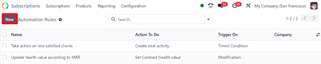

# Avtomatlashtirish qoidalari

Obunalar ishga tushirilgandan so'ng, mijozlar bilan yangilanib turishning muhim. Obunachılar ro'yxatini qo'lda ko'rib chiqmaslik uchun avtomatlashtirish ishlatish samarali. Mana shu yerda Odoo'ning *avtomatlashtirish qoidalari* funksiyasi muhim rol o'ynaydi.

Odoo *Obunalar* ilovasi foydalanuvchilarga avtomatik elektron pochta xabarlarini o'rnatishga, sotuvchilar uchun vazifalar yaratishga va hatto obunachılar o'z tajribalarini baholashlari uchun mamnuniyat so'rovlarini yuborishga imkon beradi.

## Avtomatlashtirish qoidalarini yaratish

Avtomatik qoidani yaratish uchun `Subscriptions app ‣ Configuration ‣ Automation Rules` ga o'ting. Bu yerda obunalar uchun barcha avtomatlashtirish qoidalarini topish mumkin.

`Automation Rules` sahifasi har bir qoidaning `Name`ini, `Action To Do`ni, avtomatik qoida nimaga `Trigger On` bo'lishini va qoida qo'llaniladigan `Company`ni ko'rsatadi.

Mavjud avtomatlashtirish qoidasini ko'rish yoki o'zgartirish uchun bu sahifadan kerakli qoidani bosing.

::: tip

Mavjud avtomatlashtirish qoidasini o'zgartirishda, Odoo `Action` bo'limini "kulrang" qiladi va quyidagi ogohlantirishni beradi: *Kutilmagan xatti-harakatlarni oldini olish uchun Harakat ma'lumotlarini yangilab bo'lmaydi. Buning o'rniga yangi harakat yarating.*
::::

Yangi avtomatlashtirish qoidasini yaratish uchun `New`ni bosing.

`New`ni bosish ko'p maydonlar bilan sozlash mumkin bo'lgan bo'sh `Automation Rules` formasini ochadi.

### Avtomatlashtirish qoidasi forma maydonlari

- `Action Name`: avtomatik harakat qoidasining nomi.

#### Apply On bo'limi

`Apply On` bo'limi bu avtomatik harakat qaysi obuna buyurtmalari/mijozlarga tegishli ekanligini belgilaydi.

- `MRR Between`: oylik takroriy daromadning maqsadli diabazonini belgilang.
- `MRR Change More`: maqsadli oylik takroriy daromadning o'zgarishini foiz yoki valyuta birligida belgilang.
- `Over`: belgilangan KPIlar (Asosiy ko'rsatkichlar) hisoblanadigan vaqt oralig'ini tanlang.
- `Rating Satisfaction`: mamnuniyatni foizda `greater than` yoki `less than` sifatida belgilang.
- `Status`: bu avtomatlashtirish qoidasiga kiritilishi kerak bo'lgan obunalar holati. Variantlar: `Quotation`, `Quotation Sent`, `Sales Order` va `Cancelled`.
- `Stage goes from`: obunaning ikki xil bosqichini ifodalovchi ikki maydon yordamida avtomatlashtirish qoidasi qachon faollashtiriladiganini belgilang.
- `Subscription Plans`: avtomatlashtirish qoidasi bilan maqsadli aniq obuna rejalarini tanlang.
- `Products`: avtomatlashtirish qoidasi bilan maqsadli aniq mahsulot(lar)ni tanlang.
- `Customers`: avtomatlashtirish qoidasi bilan maqsadli aniq mijoz(lar)ni tanlang.
- `Company`: ko'p kompaniyali muhitda avtomatlashtirish qoidasi bilan maqsadli aniq kompaniyaning obuna ma'lumotlarini tanlang.
- `Sales Team`: avtomatlashtirish qoidasi bilan maqsadli aniq sotuv jamoasining ma'lumotlarini tanlang.

::: tip

Agar biron-bir maydon bo'sh qoldirilsa, qoida o'sha aniq belgilashsiz barcha obunalarga tegishli bo'ladi.
::::

::: tip

Moslashtirilgan avtomatlashtirish qoidasining sozlangan mezonlariga mos keladigan obunalar soni `Apply On` maydoni pastida ko'rsatiladi.

Agar o'sha yashil obunalar havolasi bosilsa, Odoo o'sha avtomatlashtirish qoidasining mezonlariga javob beradigan barcha obunalarni ko'rsatadigan alohida sahifani ochadi.
::::

#### Action bo'limi

`Action` bo'limi avtomatik qoida ishga tushganda qanday harakat sodir bo'lishini belgilaydi.

`Action To Do` maydonida avtomatik qoida ishga tushganda sodir bo'ladigan harakatni tanlang. Bosilganda, ochiladigan menyuda quyidagi variantlar mavjud bo'ladi:

- `Create next activity`: keyingi faoliyatni yaratadi, bu `Activity` bo'limida sozlanadi va avtomatlashtirish qoidasi formasining pastida paydo bo'ladi.
- `Send an email to the customer`: avtomatlashtirish qoidasining belgilangan mezonlariga mos keladigan mijoz(lar)ga elektron pochta jo'natadi.
- `Send an SMS Text Message to the customer`: avtomatlashtirish qoidasining belgilangan mezonlariga mos keladigan mijoz(lar)ga SMS xabar jo'natadi.
- `Set Contract Health value`: obuna shartnomasining sog'liq qiymatini o'rnatadi.

Agar `Action To Do` maydonida `Send an email to the customer` tanlansa, quyidagi maydon paydo bo'ladi:

- `Email Template`: yangi elektron pochta shablonini yarating (va tahrirlang) *yoki* mijoz(lar)ga jo'natish uchun oldindan sozlangan elektron pochta shablonlari ro'yxatidan tanlang.

Agar `Action To Do` maydonida `Send an SMS Text Message to the customer` tanlansa, quyidagi maydon paydo bo'ladi:

- `SMS Template`: yangi SMS shablonini yarating (va tahrirlang) *yoki* mijoz(lar)ga jo'natish uchun oldindan sozlangan SMS shablonlari ro'yxatidan tanlang.

Agar `Action To Do` maydonida `Set Contract Health value` tanlansa, quyidagi maydon paydo bo'ladi:

- `Health`: quyidagi variantlardan birini tanlab obunaning sog'ligini belgilang: `Neutral`, `Good` yoki `Bad`.

`Trigger On` maydonida avtomatik qoida `Modification` yoki `Timed Condition` da ishga tushishini hal qiling.

::: tip

`Trigger Now` tugmasi avtomatlashtirish qoidasi formasining tepasida *faqat* qoida uchun trigger sozlanganda paydo bo'ladi.
::::

:::: warning

`Trigger Now` tugmasi bosilganda, Odoo mumkin bo'lgan vaqtli shartlardan qat'i nazar, *barcha* bog'langan obunalarda harakatni ishga tushiradi.
::::

::: tip

Odoo'da SMS matn xabari jo'natish In-App Purchase (IAP) kredit yoki tokenlarini talab qiladi. `IAP (In-App Purchase)` haqida ko'proq ma'lumot uchun `../../essentials/in_app_purchase`ga tashrif buyuring. SMS xabarlarini jo'natish haqida ko'proq ma'lumot uchun `../../marketing/sms_marketing`ga tashrif buyuring.
::::

Agar `Trigger On` maydonida `Timed Condition` tanlansa, quyidagi maydonlar paydo bo'ladi:

- `Trigger Date`: shart qachon ishga tushirilishi kerakligini ifodalaydi. Agar bo'sh qoldirilsa, harakat obuna yaratilishida *va* yangilanishida yaratiladi.
- `Delay After Trigger`: Odoo sozlangan harakatni ishga tushirishdan oldin kutish vaqtini tanlang (`Minutes`, `Hours`, `Days` yoki `Months`). Agar manfiy raqam kiritilsa, "kechikish" `Trigger Date`dan *oldin* sodir bo'ladi.

##### Activity bo'limi

Agar `Action To Do` maydonida `Create next activity` tanlansa, `Automation Rules` formasining pastida `Activity` bo'limi paydo bo'ladi.

- `Activity Type`: ochiladigan menyudan oldindan sozlangan faoliyat turini tanlang.
- `Title`: tanlangan faoliyat uchun maxsus sarlavha kiriting.
- `Note`: faoliyat tayinlangan xodim uchun eslatma qoldiring.
- `Due Date In`: faoliyat tugallanishi kerak bo'lgan kunlar sonini kiriting.
- `Assign To`: belgilangan faoliyatni quyidagilardan biriga tayinlashni tanlang: `Subscription Salesperson`, `Sales Team Leader` yoki `Specific Users`.

::: tip

Agar `Assign To` varianti sifatida `Specific Users` tanlansa, uning ostida yangi `Specific Users` maydoni paydo bo'ladi, bu yerda aniq xodim(lar) sozlangan faoliyat uchun tayinlovchi(lar) sifatida tanlanishi mumkin.
::::