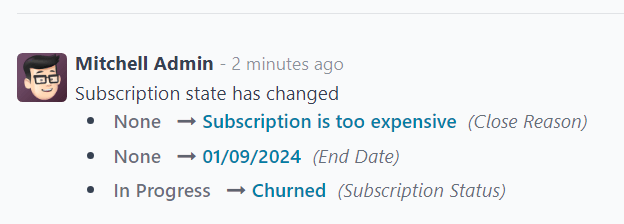

# Obunalarni yopish

Odoo *Subscriptions* bizneslar uchun mijozlar o'z obunalarini mustaqil boshqarish yoki bu imkoniyatni to'liq cheklash bo'yicha qaror qabul qilish uchun moslashuvchanlik taqdim etadi.

## Konfiguratsiya

`Subscriptions app ‣ Configuration ‣ Recurring Plans` sahifasiga o'tish bilan boshlang. U yerdan `New` tugmasini bosib yangi reja yarating yoki mavjud rejani o'zgartirish uchun tanlang.

`Recurring Plans` formasida bo'lganingizda, mijozlarga mijoz portalidan o'z obunalarini yopish imkonini berish uchun `Self-Service` bo'limidagi `Closable` opsiyasini yoqing.

## Obunani yopish

### Administrator ko'rinishi

Obuna mahsuloti uchun taklif tasdiqlangandan so'ng, u savdo buyurtmasiga aylanadi va obuna holati `In Progress` ga o'zgaradi.

Shu paytda obunani yopish imkoniyati paydo bo'ladi, `In Progress` va boshqa bosqichlarni o'z ichiga olgan qator yaqinidagi obuna buyurtmasining yuqori qismidagi `Close` tugmasi orqali. Bu imkoniyat buyurtma hisob-kitob qilinganidan va to'lov ro'yxatga olinganidan keyin ham mavjud.

`Close` tugmasini bosish `Close Reason` oynasining paydo bo'lishiga olib keladi, bu administratorlarga obunani yopish sababini kiritish yoki `Reason` maydonidagi variantlar ro'yxatidan tanlash imkonini beradi.

Kerakli `Reason` kiritilgandan so'ng, `Submit` tugmasini bosing.

`Close Reason` oynasida `Submit` tugmasini bosish obuna savdo buyurtmasini `Churned` holat tegi va belgilangan `Close Reason` bilan yangilaydi.

Xuddi shu yopish sababi savdo buyurtmasining *Chatter* qismida ham topiladi.

### Mijoz ko'rinishi

::: tip

Administrator sifatida mijozlar o'z obunalarini boshqarishda nimani ko'rishini tasavvur qilish imkoniyati obuna savdo buyurtmasining yuqori qismida joylashgan `Preview` tugmasi orqali mavjud.
::::

Mijozning nuqtai nazaridan, mijoz portalida `Close Subscription` tugmasi savdo buyurtmasining chap tomonida joylashgan.

Mijoz `Close Subscription` tugmasini bosganda, `Close Subscription` oynasi paydo bo'ladi, unda mijoz obunani nima uchun yopishni tanlayotgani haqidagi sabablar ro'yxatidan tanlashi kerak.

::: tip

Mijozlar *faqat* obuna nima uchun yopilayotgani haqida oldindan sozlangan sababni tanlashi mumkin. Ular mijoz portalidan *maxsus* sabab kira olmaydi. Bu tanlovlarni `Subscriptions ‣ Configuration ‣ Close Reasons` sahifasiga o'tish orqali sozlash mumkin.
::::

Mijoz yopish sababini tanlagandan so'ng, oynada `Submit` tugmasini bosadi.

Yopilgandan so'ng, mijoz portalidagi obuna buyurtmasi `Closed` deb belgilanadi.

Bundan tashqari, belgilangan `Close Reason` backend (Administrator ko'rinishi)dagi *Subscriptions* ilovasidagi obuna buyurtmasida paydo bo'ladi.