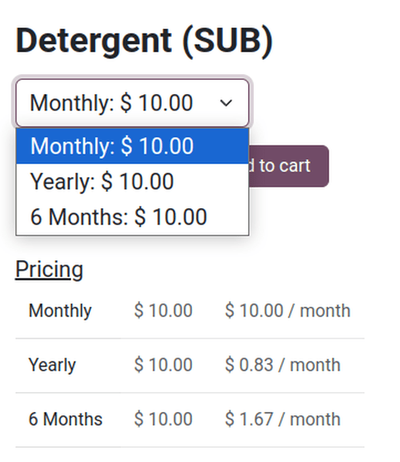

# eCommerce do'konida obunalar

Obuna mahsulotlari Odoo *eCommerce* do'konida oddiy savdo mahsulotlari kabi sotilishi mumkin.

## eCommerce obunalarini sotish

Oddiy takrorlanuvchi savdo mahsuloti sifatida `Configure subscription products ` qiling. Obunani eCommerce do'konida sotishni boshlash uchun mahsulot sahifasiga o'tish uchun `Go to Website` aqlli tugmasini bosing.

Bu yerdan obuna mahsuloti va uning takrorlanuvchi davrlarini ko'rib chiqing. Keyin yuqori o'ng burchakdagi kalitni `Unpublished` holatidan `Published` holatiga o'zgartiring.

Yangi obuna mahsuloti endi eCommerce veb-saytida turli xil takrorlanuvchi davrlar uchun variantlar bilan sotib olish uchun mavjud.

