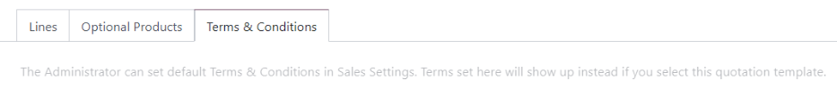

# Obuna rejalari

*Obuna rejalari* obuna mahsulotlari bilan takliflarni oldindan sozlash uchun ishlatiladigan `quotation templates` hisoblanadi.
Obuna buyurtmalarini tezkor yaratish uchun obuna rejalaridan foydalaning.

## Obuna rejalarini sozlash

Obuna rejalarini sozlash uchun `Subscriptions ‣ Configuration ‣ Plans` sahifasiga o'ting. Keyin yangi reja yaratish uchun `New` tugmasini bosing yoki mavjud rejani tahrirlash uchun tanlang.

Odoo *Subscriptions* ilovasi *Sales* ilovasi bilan yaqin integratsiyalashganligi sababli, obuna rejalari taklif shablonlari bilan bir xil formadan foydalanadi.

Obuna rejalari formasi quyidagi variantlarni o'z ichiga oladi:

- `Name`: Sahifaning yuqori qismida obuna rejasi uchun nom kiriting.
- `Quotation expires after`: Taklif yuborilgan kundan boshlab taklifning necha kun o'tgach amal qilmasligini kiriting. Taklifning hech qachon amal qilmasligini istasangiz, bu maydonni nolda qoldiring.
- `Online Confirmation`: Mijozga taklifni imzolash yoki to'lash orqali obuna buyurtmasini tasdiqlash imkonini berish uchun `Signature` yoki `Payment` yonidagi katakchalarni belgilang. Mijozga tanlov qoldirish uchun ikkalasini ham yoqing. Taklifni faqat orqa qismda tasdiqlash uchun hech birini yoqmang.
- `Confirmation Mail`: Taklif tasdiqlangandan so'ng mijozga avtomatik ravishda yuboriladigan tasdiqlash elektron pochta xabari uchun `email template` ni tanlang. Hech narsa yubormaslik uchun bu maydonni bo'sh qoldiring.
  - Yangi elektron pochta shablonini yaratish uchun shablon nomini kiriting, so'ngra `Create and edit` tugmasini bosing.
  - Mavjud elektron pochta shablonini tahrirlash uchun ochiladigan menyudan birini tanlang, so'ngra qator oxiridagi `Internal link` o'qini bosing.
- `Recurrence`: Reja uchun ishlatiladigan takrorlanish davrini tanlang. Bu yerda mavjud takrorlanish davrlari `Subscriptions ‣ Configuration ‣ Recurrence Periods` da sozlangan davrlar bilan bir xil.

`Recurrence` ni tanlash taklif shablonini obuna rejasiga aylantiradi va quyidagi qo'shimcha variantlarni yoqadi:

- `Duration`: Obuna rejasining oxirgi sanasi yo'qmi (`Forever`) yoki `Fixed` muddatimi ekanligini tanlang.
  - Agar muddat `Forever` bo'lsa, obuna rejasi mijoz yoki kompaniya obunani qo'lda tugatmaguncha doimiy ravishda yangilanadi.
  - Agar muddat `Fixed` bo'lsa, obuna avtomatik ravishda tugaydigan vaqt miqdorini belgilaydigan `End After` sanasini kiriting.
- `Self Closable`: Mijozga `customer portal` dan o'z obunasini tugatish imkonini berish uchun bu katakchani belgilang.
- `Automatic Closing`: Muddati o'tgan *to'lanmagan* obunalar *to'lov muddatidan* keyin avtomatik ravishda yopiladigan kunlar sonini kiriting.
- `Invoicing Journal`: Ushbu obuna rejasi uchun hisob-kitoblar qayd etiladigan buxgalteriya jurnalini tanlang. Eng past ketma-ketlikka ega savdo jurnalidan foydalanish uchun bu maydonni bo'sh qoldiring.

`Lines` yorlig'ida taklif uchun buyurtma qatorlarini yarating. `Add a product` tugmasini bosing, rejaga kiritish uchun mahsulotni tanlang, so'ngra `Quantity` va `Unit of Measure` ni kiriting. Buyurtma qatorlariga xohlagancha ko'p mahsulot qo'shing.

`Optional Products` yorlig'ida mijoz buyurtmani tasdiqlashdan oldin o'z taklifiga qo'sha oladigan ixtiyoriy mahsulotlarni kiriting.

Agar obuna rejasining o'ziga xos `terms and conditions` shartlari bo'lsa, ularni `Terms & Conditions` yorlig'ida qo'shing. Agar rejada shartlar belgilangan bo'lsa, ular *Sales* ilova sozlamalarida o'rnatilgan standart shartlar o'rniga ishlatiladi.

## Obuna rejalarini takliflarda ishlatish

Obuna mahsulotlari uchun takliflar ham *Subscriptions* ilovasida, ham *Sales* ilovasida yaratilishi mumkin.

`Subscriptions` boshqaruv panelidan yangi taklif yaratish uchun `New` tugmasini bosing. Keyin `Subscription Plan` maydonida obuna rejasini tanlang.

Rejadan `Recurrence`, mahsulotlar va boshqa ma'lumotlar avtomatik ravishda to'ldiriladi. Keyin taklifni zarurat bo'yicha o'zgartirish mumkin.

`Sales` boshqaruv panelidan yangi taklif yaratish uchun `New` tugmasini bosing. Keyin `Quotation Template` maydonida obuna rejasini tanlang.

Barcha obuna buyurtmalari *Subscriptions* ilovasida yoki *Sales* ilovasida yaratilganidan qat'i nazar `Subscriptions` boshqaruv panelida ko'rinadi.