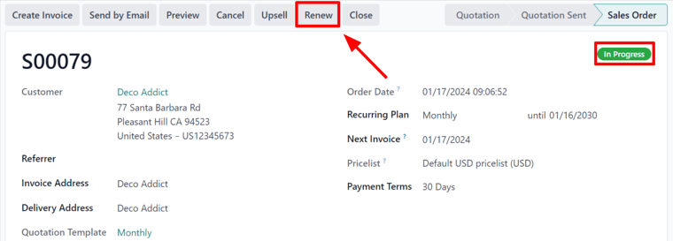
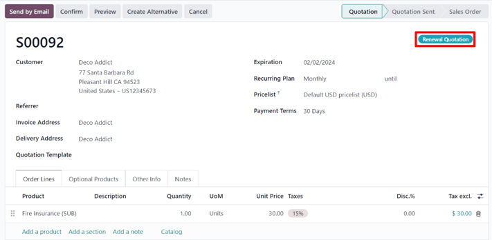
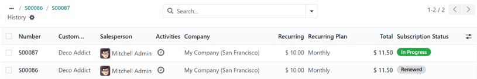

# Obunalarni yangilash

Har qanday obuna biznes modelining asosi takrorlanuvchi to'lovlardir.
Bu mijozlar obuna mahsuloti yoki xizmatiga kirish uchun belgilangan vaqt oralig'ida muntazam miqdorda ishonchli to'lov qilganlarida sodir bo'ladi.

Obunani yangilash - bu mijozlar obuna mahsuloti yoki xizmatida qatnashishni va ular uchun to'lashni davom ettirishni ixtiyoriy ravishda tanlaganlarida kuzatadigan jarayondir.

Obunachilar yangilanish jarayonini kelishilgan shartnoma muddatiga qarab turli oraliqda - haftalik, oylik, yillik va boshqalar - boshdan kechirishadi.

Obuna taklif qiluvchi ko'pgina kompaniyalar mijozlar uchun yangilanish jarayonini avtomatlashtirmoqchidir. Biroq, qo'lda obuna yangilanishi hali ham ba'zi hollarda qo'llaniladi.

Odoo **Subscriptions** ilovasi bilan kompaniya barcha obunalarini bir joyda boshqarishi mumkin. Yangilanishlar avtomatik yoki qo'lda qayta ishlanishi mumkin, har bir yangilanish buyurtmasi uchun qo'shimcha mahsulotlar yoki kengaytirishlar kiritilishi mumkin va obunalarini yangilashi kerak bo'lgan mijozlarni tezda topish uchun paket ko'rinishlarida filtrlash mumkin.

## Obuna yangilanishlari

Obunani yangilash uchun obuna mahsuloti bilan taklif **albatta** tasdiqlangan bo'lishi kerak, sozlangan *Recurring Plan* tanlangan bo'lishi kerak.

Obuna taklifini ochish uchun `Subscriptions app ‣ Subscriptions ‣ Quotations` sahifasiga o'ting va ro'yxatdan kerakli taklifni tanlang. Yoki yangi taklif formasini ochish uchun `New` tugmasini bosib yangi yarating.

::: tip

- Faqat bitta mahsulot talab qilinadi. - Obuna xizmati mahsulot hisoblanadi, chunki u takrorlanuvchi mahsulot deb hisoblanadi.
::::

Obuna takliflari **albatta** tasdiqlangan bo'lishi kerak va dastlabki obuna uchun mijozdan to'lov hisob-kitob qilingan va *Renewal Quotation* ni muvaffaqiyatli ochish uchun ro'yxatga olingan bo'lishi kerak.

Obuna taklifidan to'lov tasdiqlangandan so'ng, taklif savdo buyurtmasiga aylanadi. Savdo buyurtmasi formasiga `In Progress` tegi qo'llaniladi va savdo buyurtmasining yuqori qismida `Renew` tugmasi ham kiritilgan bir qator tugmalar paydo bo'ladi.

`Renew` tugmasi bosilganda, Odoo darhol `Renewal Quotation` tegi bilan to'ldirilgan yangi yangilanish taklifini taqdim etadi.

Bu yerdan taklifni tasdiqlash uchun standart savdo oqimi sodir bo'lishi mumkin. Bu odatda `Send by Email` tugmasini bosish bilan boshlanadi, bu taklifning nusxasini mijozga elektron pochta orqali tasdiqlashi va oxir-oqibat to'lashi uchun yuboradi.

::: tip

`Renewal Quotation` chatterida bu obuna asl savdo buyurtmasidan obunaning yangilanishi ekanligi ta'kidlangan.
::::

`Renewal Quotation` tasdiqlangandan so'ng, u savdo buyurtmasiga aylanadi va sahifaning yuqori qismida `Sales History` aqlli tugmasi paydo bo'ladi.

`Sales History` aqlli tugmasi bosilganda, Odoo ushbu obunaga bog'langan turli savdo buyurtmalarini ularning alohida `Subscription Status` bilan birga ko'rsatuvchi alohida sahifani ochadi.

Bundan tashqari, `Renewal Quotation` tasdiqlangandan so'ng, savdo buyurtmasining yuqori qismida `MRR` aqlli tugmasi ham paydo bo'ladi.

Bosilganda, Odoo ushbu maxsus obuna bilan bog'liq oylik takrorlanuvchi daromadni batafsil bayon qiluvchi `MRR Analysis` sahifasini ochadi.

::: warning

Kam hollarda avtomatik to'lov muvaffaqiyatsiz bo'lishi mumkin, bu to'lov usulida xatolik bo'lsa, savdo buyurtmasining yuqori o'ng qismida *Payment Failure* tegini keltirib chiqaradi.

Bu keyingi marta rejalashtirilgan harakat bajarilganda tizimni mijozdan yana haq olishdan saqlash uchun amalga oshiriladi. To'lov holati noaniq bo'lganligi sababli, Odoo to'lov yana ishlatilishidan oldin to'lov amalga oshirilgan-oshirilmaganini tekshirish uchun qo'lda operatsiya talab qiladi.

Buning uchun `Subscriptions app ‣ Subscriptions ‣ Quotations` sahifasiga o'ting. Kerakli obunaga o'ting, so'ngra to'lov amalga oshirilgan-oshirilmaganini ko'rish uchun *Chatter* ni tekshiring.

Agar to'lov **amalga oshirilmagan** bo'lsa, avval `debug mode` ni kiriting. Keyin `Other Info` yorlig'ini bosing va `Contract in exception` yonidagi katak belgilarini olib tashlang. Savdo buyurtmasini qayta yuklang va `Payment Failure` tegi yo'qoladi.

Agar to'lov **amalga oshirilgan** bo'lsa, yangi hisob-kitob qo'lda yaratilishi va e'lon qilinishi kerak. Bu obunaning keyingi hisob-kitob sanasini avtomatik ravishda yangilaydi. Yaratilgandan so'ng, `debug mode` ni kiriting va yangi savdo buyurtmasiga o'ting. `Other Info` yorlig'ini bosing va `Contract in exception` yonidagi katak belgilarini olib tashlang. Savdo buyurtmasini qayta yuklang va `Payment Failure` tegi yo'qoladi.

The contract in exception
option selected with the :guilabel:`payment failure tag
shown.

Ikkala holatda ham `Contract in exception` opsiyasi endi tanlanmaganidan so'ng, Odoo yangilanishlarni yana avtomatik ravishda boshqaradi. Agar obuna *to'lov muvaffaqiyatsizligida* qolsa, savdo buyurtmasi yopilmaguncha Odoo tomonidan o'tkazib yuboriladi.
::::