# Obuna hisobotlari

Odoo **Subscriptions** ilovasi kompaniyalarga obunalar qanchalik yaxshi ishlayotganini tahlil qilishda yordam beradigan bir qator hisobot sahifalarini taqdim etadi.

`Subscriptions Analysis` hisobot sahifasida foydalanuvchilar takrorlanuvchi obunalar, obunalar miqdori, davom etayotgan yoki to'xtatilgan obunalar va boshqalar bilan bog'liq aniq ma'lumotlarni ko'rishlari mumkin.

`Retention Analysis` hisobot sahifasi har qanday vaqt oralig'ida obunalarni ushlab qolish foizlarining tartibli jadvalini taqdim etadi.

`MRR Breakdown` hisobot sahifasi obunalar uchun `MRR (Monthly Recurring Revenue)` va `ARR (Annual Recurring Revenue)` ko'rsatkichlarini turli xil grafiklar, ro'yxatlar va diagrammalarga aniq tarzda ajratadi.

Va `MRR Analysis` hisobot sahifasi obuna `MRR (Monthly Recurring Revenue)` va `ARR (Annual Recurring Revenue)` har qanday muayyan vaqt oralig'ida qanday o'zgarganini ko'rsatadigan vaqtga asoslangan tahlillar to'plamini taklif qiladi.

## Hisobot sahifasi elementlari

Barcha obunaga asoslangan hisobot sahifalarga **Subscriptions** ilovasidagi `Reporting` sarlavha menyusi orqali kirish mumkin.

Quyidagi bo'limlar har bir hisobot sahifasida mavjud elementlarni tasvirlaydi.

### Filtrlar va Guruhlash

`Filters` aniq tahlillarni ko'rsatish uchun ko'rsatkichlarni qisqartirish uchun ishlatiladi, guruhlar esa (`Group By` opsiyasi orqali) ma'lumotlarni aniqroq tashkil etilgan tahlil uchun muayyan bo'limlardan guruhlarga yig'ish uchun ishlatiladi.

Ushbu bo'lim filtrlar va guruhlashga taalluqli, chunki ikkalasining kombinatsiyasi `Favorites` bo'limida saqlanishi mumkin.

Har qanday hisobot sahifasida ko'rsatilayotgan natijalarni o'zgartirish uchun qidiruv paneli o'ng tomonidagi `fa-caret-down` `(pastga yo'nalgan o'q)` belgisini bosing. Buni qilish batafsil filtr va guruhlash variantlarining pastga tushuvchi menyusini ochadi.

Agar kerak bo'lsa, filtr yoki guruhlash (yoki filtrlar va/yoki guruhlashlarning kombinatsiyasi) ushbu pastga tushuvchi menyuning `Favorites` bo'limida saqlanishi mumkin. Buning uchun `Favorites` bo'limi ostida joylashgan `Save current search` yonidagi `fa-caret-down` `(pastga yo'nalgan o'q)` belgisini bosing.

Bu sevimli filtrga nom berish uchun maydonni ochadi. Nom maydoni ostida ikkita variant ham mavjud: `Default filter` va `Shared`.

`Default filter` yonidagi katakchani belgilash yangi sevimli filtrni ushbu hisobot sahifasi uchun standart variant qiladi.

`Shared` yonidagi katakchani belgilash yangi sevimli filtrni ma'lumotlar bazasidagi boshqa foydalanuvchilar uchun ham mavjud qiladi.

::: tip

`Default filter` va `Shared` variantlari **majburiy emas**, va bu variantlardan faqat *bittasi* bir vaqtda tanlanishi mumkin.
::::

Filtrni saqlash uchun pastga tushuvchi filtr menyusining `Favorites` bo'limida `Save` tugmasini bosing.

Bosilganda, saqlanган filtr pastga tushuvchi filtr menyusining `Favorites` ustuni ostida paydo bo'ladi va qidiruv panelida sevimli filtr nomi yonida `fa-star` `(oltin yulduz)` belgisi paydo bo'ladi.

### Ko'rinishlar

`Subscription Analysis`, `MRR Breakdown` va `MRR Analysis` hisobot sahifalarida yuqori o'ng burchakda uchta turli ko'rinish variantlari joylashgan.

::: tip

`Retention Analysis` hisobot sahifasida *boshqa* ko'rinish variantlari mavjud emas.
::::

Mavjud ko'rinish variantlari, chapdan o'ngga:

- `Graph`
- `List`
- `Pivot`

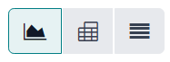

Har bir ko'rinish o'zining ko'rinishga xos vizual variantlari seriyasiga ega.

#### Grafik ko'rinishi

Grafik ko'rinishi tanlanganda, qidiruv paneli va ma'lumotlarning vizual tasviri o'rtasida quyidagi variantlar paydo bo'ladi. Ushbu grafikga xos variantlar `Measures` va `Insert in Spreadsheet` tugmalari o'ng tomonida joylashgan.

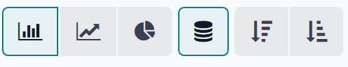

Birinchi uchta variant, chapdan o'ngga, turli grafik bilan bog'liq ko'rinishlarni ifodalaydi. Qolgan variantlar ushbu aniq grafikka bog'liq ma'lumotlarni tashkil etish va vizualizatsiya qilishning turli usullarini ifodalaydi.

Chapdan o'ngga, aniq grafikka bog'liq ko'rinish variantlari:

- `fa-bar-chart` `Bar Chart`: ma'lumotlarni ustunli diagramma formatida ko'rsatadi.
- `fa-line-chart` `Line Chart`: ma'lumotlarni chiziqli diagramma formatida ko'rsatadi.
- `fa-pie-chart` `Pie Chart`: ma'lumotlarni doiraviy diagramma formatida ko'rsatadi.

Har bir grafik ko'rinishi varianti o'zining aniq vizual variantlari seriyasiga ega, ular tanlangan grafikka bog'liq ko'rinish varianti o'ng tomonida paydo bo'ladigan mavjud tugmalar bilan ifodalanadi.

`fa-bar-chart` `Bar Chart` grafik ko'rinishi tanlanganda, quyidagi vizual variantlar mavjud:

- `fa-database` `Stacked`: ma'lumotlarni qatlamli vizual formatda ko'rsatadi.
- `fa-sort-amount-desc` `Descending`: ma'lumotlarni kamayish tartibida ko'rsatadi.
- `fa-sort-amount-asc` `Ascending`: ma'lumotlarni o'sish tartibida ko'rsatadi.

`Line Chart` grafik ko'rinishi tanlanganda, quyidagi vizual variantlar mavjud:

- `fa-database` `Stacked`: ma'lumotlarni qatlamli vizual formatda ko'rsatadi.
- `fa-signal` `Cumulative`: ma'lumotlarni to'plangan, o'sib boruvchi formatda ko'rsatadi.
- `fa-sort-amount-desc` `Descending`: ma'lumotlarni kamayish tartibida ko'rsatadi.
- `fa-sort-amount-asc` `Ascending`: ma'lumotlarni o'sish tartibida ko'rsatadi.

`Pie Chart` grafik ko'rinishi tanlanganda, qo'shimcha vizual variantlar yo'q.

#### Ro'yxat ko'rinishi

Ro'yxat ko'rinishi tanlanganda, tahlil qilinayotgan obuna ko'rsatkichlari oddiy ro'yxatda ko'rsatiladi, uni pastga tushuvchi filtr menyusida mavjud filtrlar yoki guruhlashlardan foydalanib to'liq sozlash mumkin (qidiruv paneli o'ng tomonidagi `fa-caret-down` `(pastga yo'nalgan o'q)` belgisi orqali kirish mumkin).

::: tip

Ro'yxat ko'rinishi tanlanganda, `Measures` pastga tushuvchi menyusi va `Insert in Spreadsheet` tugmasi mavjud *emas*.
::::

#### Pivot ko'rinishi

Pivot ko'rinishi tanlanganda, obuna ko'rsatkichlari to'liq sozlanishi mumkin bo'lgan ma'lumotlar jadvalida ko'rsatiladi.

Pivot ma'lumotlar jadvalini `Measures` pastga tushuvchi menyusida mavjud variantlar va/yoki filtr pastga tushuvchi menyusida mavjud filtr guruhlash variantlari yordamida sozlash mumkin (qidiruv paneli o'ng tomonidagi `fa-caret-down` `(pastga yo'nalgan o'q)` belgisi orqali kirish mumkin).

Uchta pivotga xos variant mavjud, ular `Measures` pastga tushuvchi menyusi va `Insert in Spreadsheet` tugmasi o'ng tomonida joylashgan.

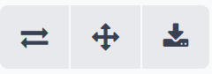

Chapdan o'ngga, pivot ko'rinishiga xos variantlar:

- `fa-exchange` `Flip axis`: pivot ma'lumotlar jadvalining [x] va [y] o'qlari almashadi.
- `fa-arrows` `Expand all`: pivot ma'lumotlar jadvalining barcha mavjud qatorlari va ustunlari to'liq kengayadi.
- `fa-download` `Download .xlsx`: pivot ma'lumotlar jadvali `.xlsx` fayl sifatida yuklab olinadi.

### O'lchashlar

Grafik va pivot hisobot sahifalari qidiruv paneli ustida, ko'rsatkichlarning vizual tasviri ustida joylashgan, tanlash uchun ma'lumotlar bilan bog'liq variantlarning o'ziga xos `Measures` pastga tushuvchi menyusiga ega.

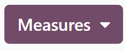

`Measures` tugmasi bosilganda, pastga tushuvchi menyu orqali tanlanadigan o'lchashlar seriyasi mavjud bo'ladi. `Measures` pastga tushuvchi menyusidan har qanday variant tanlanganda, ushbu aniq o'lchash bilan bog'liq tanlangan ko'rsatkichlar hisobot sahifasida paydo bo'ladi.

::: tip

Har bir hisobot sahifasida ishlatilishi mumkin bo'lgan turli o'lchashlar haqida ko'proq ma'lumot olish uchun, ushbu hujjatlashtirishda quyida keltirilgan `aniq hisobot sahifasi taqsimotlari`ga qarang.
::::

### Elektron jadvalga kiritish

`Measures` pastga tushuvchi menyusi yonida `Insert in Spreadsheet` tugmasi mavjud.

Bosilganda, hisobot sahifasida hozirda ko'rsatilayotgan sozlangan ma'lumotlarni yangi yoki mavjud elektron jadval yoki boshqaruv panelige qo'shish imkoniyati paydo bo'ladi, bu ochiluvchi oyna orqali amalga oshiriladi.

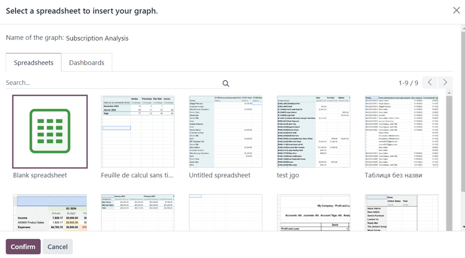

Ushbu ochiluvchi oynadan kerakli variantni tanlang, so'ngra `Confirm` tugmasini bosing.

## Hisobot sahifalari

Odoo **Subscriptions** ilovasida to'rtta turli hisobot sahifasi mavjud.

Obunalar bilan bog'liq turli hisobotlarga kirish, tahlil qilish va sozlash uchun `Subscriptions app`ga o'ting va sarlavhadagi `Reporting` pastga tushuvchi menyusini bosing, bu quyidagi hisobot sahifalarini ochadi:

- `Subscriptions`
- `Retention`
- `MRR Breakdown`
- `MRR Timeline`

Ushbu variantlardan birortasini bosish obuna ma'lumotlarining ushbu muayyan jihatiga qaratilgan alohida, to'liq sozlanadigan hisobot sahifasini ochadi.

Quyida ushbu to'rtta aniq hisobot sahifasining taqsimoti keltirilgan.

### Obunalar tahlili

`Subscriptions Analysis` hisobot sahifasiga kirish uchun `Subscriptions app ‣ Reporting ‣ Subscriptions`ga o'ting.

Standart bo'yicha, `Subscriptions Analysis` hisobot sahifasida `Graph` ko'rinishida `Bar Chart` varianti tanlangan.

Qidiruv panelida quyidagi filtrlar ham mavjud: `In Progress or Paused` va `Recurring`.

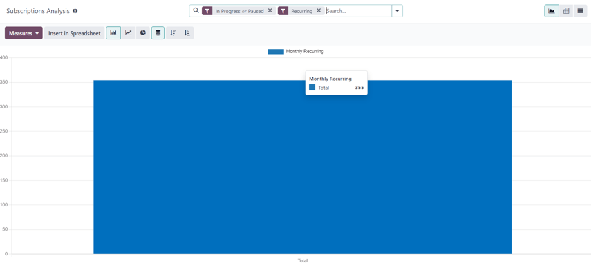

`Subscriptions Analysis` sahifasida `Measures` tugmasi bosilganda, ko'rsatkichlar bilan bog'liq variantlar seriyasi pastga tushuvchi menyu sifatida mavjud bo'ladi.

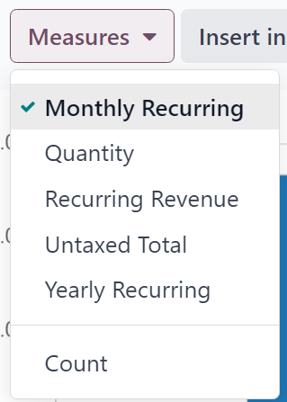

`Subscriptions Analysis` sahifasidagi `Measures` pastga tushuvchi menyusidagi ko'rsatkichlar bilan bog'liq variantlar:

- `Monthly Recurring`
- `Quantity`
- `Recurring Revenue`
- `Untaxed Total`
- `Yearly Recurring`
- `Count`

::: tip

`Monthly Recurring` o'lchash varianti standart bo'yicha tanlangan.
::::

Ushbu mavjud o'lchashlardan biri bosilganda, Odoo tanlangan ma'lumotlarni keyingi tahlil uchun hisobot sahifasida ko'rsatadi.

### Ushlab qolish tahlili

`Retention Analysis` hisobot sahifasiga kirish uchun `Subscriptions app ‣ Reporting ‣ Retention`ga o'ting.

`Retention Analysis` hisobot sahifasi boshqa **Subscriptions** ilovasi hisobot sahifalaridan farq qiladi, chunki u **hech qanday** qo'shimcha ko'rinish variantlarini taqdim etmaydi. Ushbu sahifadagi ma'lumotlar faqat sozlanadigan ma'lumotlar jadvalida taqdim etiladi.

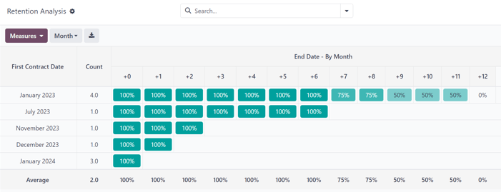

`Retention Analysis` hisobot sahifasidagi `Measures` pastga tushuvchi menyusi bosilganda, ko'rsatkichlar bilan bog'liq variantlar seriyasi mavjud bo'ladi.

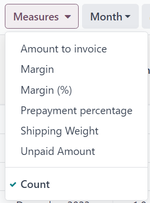

`Retention Analysis` hisobot sahifasidagi `Measures` pastga tushuvchi menyusidagi ko'rsatkichlar bilan bog'liq variantlar:

- `Amount to invoice`
- `Margin`
- `Margin (%)`
- `Prepayment percentage`
- `Shipping Weight`
- `Unpaid Amount`
- `Count`

::: tip

`Count` o'lchash varianti standart bo'yicha tanlangan.
::::

`Retention Analysis` sahifasidagi `Measures` pastga tushuvchi menyusi o'ng tomonida turli vaqt oralig'larini o'z ichiga olgan qo'shimcha pastga tushuvchi menyu mavjud. Standart vaqt oralig'i `Month`.

Bosilganda, turli vaqt oralig'i variantlarining pastga tushuvchi menyusi mavjud bo'ladi.

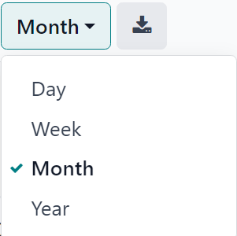

Vaqt oralig'i variantlari:

- `Day`
- `Week`
- `Month`
- `Year`

Ushbu pastga tushuvchi menyudan vaqt oralig'i varianti tanlanganda, `Retention Analysis` hisobot sahifasi ushbu vaqt oralig'i ichida sozlangan o'lchashlar va filtrlar uchun ma'lumotlarni ko'rsatadi.

Vaqt oralig'i pastga tushuvchi menyusi o'ng tomonida yuklab olish tugmasi mavjud, bu foydalanuvchiga `Retention Analysis` sahifasida taqdim etilgan ma'lumotlarni Excel fayli sifatida yuklab olish imkonini beradi.

### MRR taqsimoti

`MRR Breakdown` hisobot sahifasiga kirish uchun `Subscriptions app ‣ Reporting ‣ MRR Breakdown`ga o'ting.

Standart bo'yicha, `MRR Breakdown` hisobot sahifasida ko'rsatilgan ma'lumotlar grafik ko'rinishida, `Bar Chart` va `Stacked` variantlari tanlangan holda.

Qidiruv panelida `Event Date: Month > Event Type` uchun standart filtr ham mavjud.

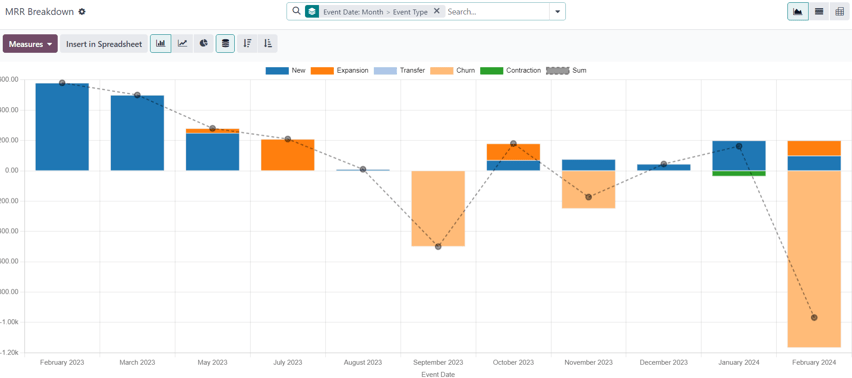

`MRR Breakdown` hisobot sahifasidagi `Measures` pastga tushuvchi menyusi bosilganda, ko'rsatkichlar bilan bog'liq variantlar seriyasi mavjud bo'ladi.

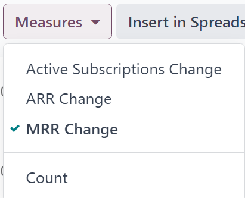

`MRR Breakdown` hisobot sahifasidagi `Measures` pastga tushuvchi menyusidagi ko'rsatkichlar bilan bog'liq variantlar:

- `Active Subscriptions Change`
- `ARR Change`
- `MRR Change`
- `Count`

::: tip

`MRR Change` o'lchash varianti standart bo'yicha tanlangan.
::::

::: tip

Boshqa o'lchash variantini standart qilish uchun, avval `Measures` pastga tushuvchi menyusidan kerakli o'lchashni tanlang. Keyin qidiruv panelida `fa-caret-down` `(pastga yo'nalgan o'q)` belgisini bosib filtrlar va guruhlashlarning katta menyusini oching.

`Favorites` ustunida `Save current search` yonidagi `fa-caret-down` `(pastga yo'nalgan o'q)` belgisini bosib nom kiritish mumkin bo'lgan maydon va ikkita katakcha `Default filter` va `Shared`ni ochadi.

`Default filter` uchun katakchani belgilang va `Save` tugmasini bosing.

Yangi tanlangan o'lchash varianti endi ushbu hisobot sahifasiga kirganda paydo bo'ladigan standart variant bo'ladi.
::::

### MRR tahlili

`MRR Analysis` hisobot sahifasiga kirish uchun `Subscriptions app ‣ Reporting ‣ MRR Timeline`ga o'ting.

Standart bo'yicha, `MRR Analysis` hisobot sahifasida ko'rsatilgan ma'lumotlar grafik ko'rinishida, `Line Chart`, `Stacked` va `Cumulative` variantlari tanlangan holda.

Qidiruv panelida `Event Date: Month` uchun standart filtr ham mavjud.

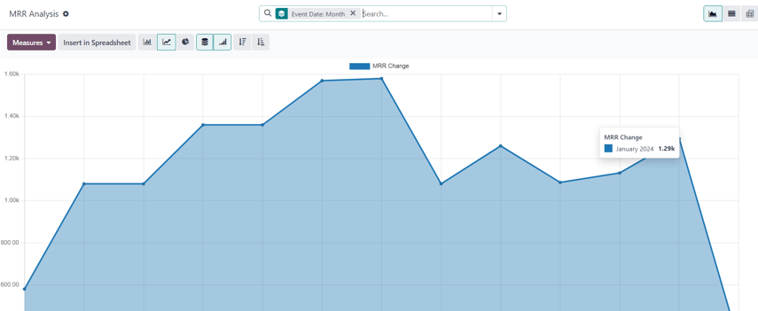

`MRR Analysis` hisobot sahifasidagi `Measures` pastga tushuvchi menyusi bosilganda, ko'rsatkichlar bilan bog'liq variantlar seriyasi mavjud bo'ladi.

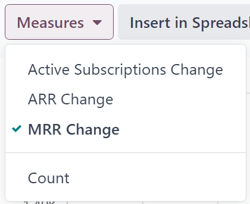

`MRR Analysis` hisobot sahifasidagi `Measures` pastga tushuvchi menyusidagi ko'rsatkichlar bilan bog'liq variantlar:

- `Active Subscriptions Change`
- `ARR Change`
- `MRR Change`
- `Count`

::: tip

`MRR Change` o'lchash varianti standart bo'yicha tanlangan.
::::