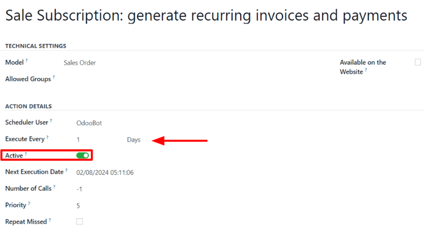
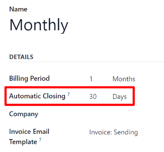

# Rejalashtirilgan harakatlar

*Rejalashtirilgan harakatlar* - bu foydalanuvchilarga belgilangan jadval yoki takrorlanish soniga asoslanib ma'lumotlar bazasidagi muayyan vazifalarni avtomatlashtirish imkonini beradigan oldindan sozlangan jarayonlardir. Bu vazifalar email yuborish, hisob-kitob yaratish, ma'lumotlarni tozalash va boshqa ko'plab ishlarni o'z ichiga olishi mumkin.

Odoo'da ba'zi rejalashtirilgan harakatlar muayyan funktsiyalarning avtomatik ishga tushishini ta'minlash uchun standart bo'yicha faol, ammo ma'lumotlar bazasida ko'rinadigan ko'plab rejalashtirilgan harakat variantlari mavjud bo'lib, ular standart bo'yicha **faolashtirilmagan**.

Odoo *Subscriptions*da faol takrorlanuvchi obunalar uchun hisob-kitob jarayonini boshlash, shuningdek obuna muddati tugashi sababli hisob-kitob qachon to'xtatilishi kerakligini aniqlaydigan ikkita rejalashtirilgan harakat mavjud.

Ular standart bo'yicha yoqilgan va obunalarni qo'lda boshqarish uchun istalgan vaqtda o'chirilishi mumkin.

## Rejalashtirilgan harakatlarga kirish

::: warning

Rejalashtirilgan harakatlarga kirish uchun `developer mode` **majburiy** ravishda faollashtirilishi kerak.
::::

Dasturchi rejimi faollashtirilgan holda, `Settings app ‣ Technical ‣ Scheduled Actions`ga o'ting.

Buni qilish maxsus `Scheduled Actions` boshqaruv panelini ochadi. Ushbu sahifada butun ma'lumotlar bazasi uchun rejalashtirilgan harakatlarning to'liq ro'yxati mavjud.

Bu yerdan qidiruv panelida [Subscription] deb kiriting. Buni qilish obunaga oid uchta natijani beradi. Quyidagi hujjatlashtirishda ro'yxatdagi so'nggi ikkita natijaga e'tibor qaratiladi:

- `Sale Subscription: generate recurring invoices and payments`
- `Sale Subscription: subscriptions expiration`

Rejalashtirilgan harakat faol ekanligini aniqlash uchun `Scheduled Actions` boshqaruv panelida uning mos keladigan qatoridagi `Active` ustuni ostida belgilangan katakchani qidiring; agar katakcha yashil rangda va belgi bilan bo'lsa, rejalashtirilgan harakat faol.

Agar rejalashtirilgan harakatni faollashtirish kerak bo'lsa, ro'yxatdan kerakli rejalashtirilgan harakatni bosing.

Keyin rejalashtirilgan harakat formasidan `Active` maydonidagi tugmachani o'ng tomonga suring. Buni qilish tugmachani yashil rangga o'tkazadi, bu rejalashtirilgan harakat endi [Active] ekanligini ko'rsatadi.

Rejalashtirilgan harakatning qanchalik tez-tez ishlashini sozlash imkoniyati ham rejalashtirilgan harakat formasidagi `Execute Every` maydonida mavjud.

::: warning

Agar bajarilish vaqti besh daqiqadan kam bo'lsa, rejalashtirilgan harakat to'g'ri **ishlamaydi**. Bu barcha rejalashtirilgan harakatlar uchun umumiy qoida.

Qo'shimcha ma'lumot uchun `Frequent Technical Questions` hujjatlarini o'qing.
::::

## Takrorlanuvchi hisob-kitob va to'lovlarni yaratish

`Sale Subscription: generate recurring invoices and payments` rejalashtirilgan harakati obunalar bo'yicha takrorlanuvchi hisob-kitob va to'lovlarni to'g'ri yaratishi uchun, Odoo'ning obunalar bilan bog'liq turli hisob-kitob va to'lovlarni qayta ishlashi uchun *Deferred Expense* va *Deferred Revenue* hisoblari **majburiy** ravishda sozlanishi kerak.

*Deferred Expense* va *Deferred Revenue* hisoblarini sozlash uchun `Accounting app ‣ Configuration ‣ Settings`ga o'ting. Ikkala hisob ham `Default Accounts` bo'limida sozlanishi mumkin.

`Deferred Expense` va `Deferred Revenue` pastga tushuvchi menyu maydonlariga to'g'ri hisoblar kiritilgandan so'ng, yuqori chap burchakda `Save` tugmasini bosing.

### Hisob-kitob yaratish

`Sale Subscription: generate recurring invoices and payments` rejalashtirilgan harakati bilan bog'liq elementlarni tasdiqlangan obuna savdo buyurtmalarida topish mumkin.

Ushbu elementlarni tekshirish uchun *Subscriptions* ilovasida har qanday tasdiqlangan savdo buyurtmasini ochib obuna savdo buyurtmasi formasini ochadi.

Tasdiqlangan obuna savdo buyurtmasi formasida `Recurring Plan` va `Date of Next Invoice` maydonlariga e'tibor bering.

Rejalashtirilgan harakat bugungi sana `Date of Next Invoice` sanasi bilan bir xil bo'lganda hisob-kitob yaratadi.

Odoo `Recurring Plan` maydonidagi ma'lumotlardan keyingi hisob-kitob sanasini mos ravishda yangilash uchun foydalanadi.

:::: warning

Agar mahsulot hisob-kitob siyosati *Based on Delivered Quantities (Manual)* ga o'rnatilgan bo'lsa va yetkazilgan miqdor [0] bo'lsa, Odoo hisob-kitob **yaratmaydi** va mijozdan pul olinmaydi.

Buning o'rniga obuna bepul takrorlanuvchi mahsulot sifatida qayta ishlanadi va obuna savdo buyurtmasining *chatter*ida shunday aks ettiriladi.

Bu sodir bo'lganda quyidagi xabar paydo bo'ladi: [Automatic renewal succeeded. Free subscription. Next invoice:\[date\]. No email sent.]
::::

Obuna savdo buyurtmasi uchun hisob-kitob yaratilgandan so'ng, hisob-kitobni obuna savdo buyurtmasining yuqori qismida paydo bo'ladigan `Invoices` aqlli tugmasini bosish orqali ko'rish mumkin.

Agar hisobda `Payment Token` mavjud bo'lsa, mijozga takrorlanuvchi obuna to'lovi haqida xabardor qiluvchi email yuboriladi.

`Payment Token` mavjudligini tekshirish uchun `Other Info` yorlig'ini oching va `Subscription` bo'limi ostidagi `Payment Token` maydonini ko'ring.

Agar `Payment Token` mavjud bo'lmasa, hisob-kitob yaratiladi va mijozga yuboriladi. Bu holda to'lov **qo'lda** ro'yxatdan o'tkazilishi kerak.

### Hisob-kitoblarni yopish

`Sale Subscription: generate recurring invoices and payments` rejalashtirilgan harakati quyidagi shartlar bajarilsa obunani yopish imkoniyatiga ham ega:

- Agar obunada `Payment Token` bo'lmasa, hisob-kitobni yaratish va joylash.

- Agar obunada `Payment Token` mavjud bo'lsa, to'lovni amalga oshirishga harakat qilish.

  > - Agar to'lov muvaffaqiyatli bo'lsa, hisob-kitobni yaratish va joylash.
  >
  > - Agar to'lov muvaffaqiyatsiz bo'lsa, vaqti-vaqti bilan eslatmalar yuborish.
  >
  >   > - Agar o'n to'rt kundan ortiq muvaffaqiyatsiz bo'lishda davom etsa, obunani yopish.

## Obunalar muddati tugashi

`Sale Subscription: subscriptions expiration` rejalashtirilgan harakati obunaning avtomatik yopilishiga sabab bo'lishi mumkin bo'lgan boshqa barcha shartlarni tekshiradi. Agar muayyan shartlar bajarilsa, rejalashtirilgan harakat bu obunani yopadi.

Birinchidan, `Sale Subscription: subscriptions expiration` rejalashtirilgan harakati obuna savdo buyurtmasida sozlangan tugash sanasi o'tganligini tekshiradi.

Keyin `Sale Subscription: subscriptions expiration` rejalashtirilgan harakati hisob-kitob to'lov shartlari muddat ichida to'lanmaganligini tekshiradi.

Obunaga biriktirilgan hisob-kitoblarga kirish uchun obuna mahsuloti uchun savdo buyurtmasiga kiring va `Invoices` aqlli tugmasini bosing. Keyin `Invoice Date` ustunini ko'ring.

`Recurring Plan`ning `Automatic Closing` maydonida belgilangan kunlar sonidan o'tgan `Invoice Date`ga ega to'lanmagan obunalar `Sale Subscription: subscriptions expiration` rejalashtirilgan harakati tomonidan avtomatik yopiladi.

Masalan, agar keyingi hisob-kitob sanasi 1-iyul bo'lsa va `Automatic Closing` '30 Days'ga o'rnatilgan bo'lsa, rejalashtirilgan harakat obunani 1-avgustda yopadi.