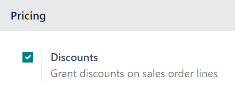
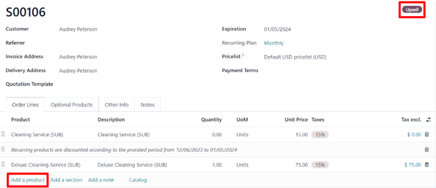

# Obunalarni upselling qilish

Obunalar takrorlanuvchi bo'lib, cheksiz davom etadi. Vaqt o'tishi bilan
mijozlar ularni o'zgartirishni xohlashi mumkin. Shu sababli, har qanday
ehtiyojni qondirish uchun narxlarni moslash yoki miqdorlarni o'zgartirish
imkoniyatiga ega bo'lish juda muhim. Aynan shu yerda obunani upselling
qilish imkoniyati paydo bo'ladi.

Upselling quyidagi mijoz turlariga foydali bo'lishi mumkin:

1. | *Sodiq mijozlar*
   | Bular kompaniya/brendga ishongan mijozlar bo'lib,
   mahsulot/xizmatlar uchun to'lov qilish odatini o'rnatganligi sababli,
   qimmatroq mahsulot/xizmatlarni sotish urinishida ko'proq ishonch
   mavjud.

2. | *Yangi mijozlar*
   | Kompaniya/brend bilan tanish bo'lmagan yangi mijozlar uchun
   ularni qimmatroq mahsulot/xizmat sotib olishga undash uchun
   yangi, jozibali taktika qo'llanilishi kerak.

   > Bunday hollarda chegirmalar foydali bo'lishi mumkin. Odatda,
   > obunalar ma'lum vaqt o'tgach tugaydi.
   >
   > Shunday qilib, agar bu qimmatroq mahsulot/xizmatlar yangi
   > mijozlarga chegirma bilan taklif qilinsa, bu sotuvga olib kelishi
   > va mijoz bilan kompaniya/brend o'rtasida kuchli ishonch o'rnatilishi
   > mumkin. Bu o'z navbatida mijozlarni saqlab qolishni oshirishi mumkin,
   > chunki ular vaqt o'tishi bilan yanada qulay va ishonchli bo'lib qoladi.

## Chegirma konfiguratsiyasi

Yangi mijozga chegirma yordamida obunani upselling qilish imkoniyatiga
ega bo'lish uchun *Chegirmalar* funksiyasi **albatta** faollashtirilishi
kerak.

*Chegirmalar* funksiyasini faollashtirish uchun
`Sales app ‣ Configuration ‣
Settings` ga o'ting,
`Pricing` bo'limiga pastga aylanib,
`Discounts` yonidagi katakchani belgilang. Keyin
`Save` tugmasini bosing.

Ushbu funksiya faollashtirilgan holda, sotuv buyurtmasi qatorlarida
chegirmalar berish imkoniyati paydo bo'ladi.

### Obunalarni upselling qilish

Obunani upselling qilishdan oldin, obuna mahsulotlaridan foydalanib
`Create a quotation
` bo'yicha hujjatlarimizni ko'rib chiqing.

Obuna bilan taklif tasdiqlanganda, u rasman sotuv buyurtmasiga aylanadi
va Odoo *Subscriptions* ilovasida yangi obuna yaratiladi.

::: tip

Obuna sotuv buyurtmasi upselling amalga oshirilishidan *oldin* hisob-faktura
qilinishi **shart**.
::::

Obuna sotuv buyurtmasi *Sales* yoki *Subscriptions* ilovasida ochilganda,
sotuv buyurtmasining yuqori qismidagi `Upsell`
tugmasi orqali ushbu obunani upselling qilish imkoniyati mavjud.

`Upsell` tugmasi bosilganda,
yuqori o'ng burchakda `Upsell` holat banneri bilan yangi taklif formasi paydo bo'ladi. Boshlang'ich
obuna mahsuloti allaqachon `Order Lines` tabida mavjud.

Shuningdek, `Order Lines` tabidagi
boshlang'ich obuna mahsuloti ostida takrorlanuvchi mahsulotlar prorated
vaqt davriga muvofiq chegirma qilinganligini eslatuvchi ogohlantirish
mavjud.

::: warning

Prorated miqdor **faqat** *Service* mahsulot turlariga qo'llaniladi. U
*Consumable* yoki *Storable* mahsulot turlariga qo'llanilmaydi, xabar
paydo bo'lsa ham.
::::

Ushbu yangi upsell taklif formasidan `Order Lines`
tabida `Add a product` tugmasini bosib
va kerakli obuna mahsulotini tanlash orqali yangi obuna mahsulotlarini
qo'shing.

Kerakli upsell obuna mahsulot(lar)i qo'shilgandan so'ng, uni mijozning
tasdiqlashi uchun `Send by Email`
tugmasini bosish orqali yuborish mumkin.

::: warning

Taklif mijoz tomonidan tasdiqlanganda, upsell mahsulotlari boshlang'ich
obunaga qo'shiladi. Taklif narxlari keyinchalik joriy hisob-faktura
davrining qolgan vaqtiga nisbatan prorate qilinadi.
::::

::: tip

Yangi taklifni mijozga yuborishdan oldin, birlik narxi, soliqlar va hatto
chegirma ham qo'llanilishi mumkin.
::::

Mijoz tasdiqlasa, taklifdagi `Confirm`
tugmasini bosib, uni sotuv buyurtmasiga aylantiring. Bu bosilganda,
`Sales History` smart tugmasi paydo bo'ladi
va ushbu boshlang'ich obuna buyurtmasiga nechta sotuv buyurtmasi biriktirilganligini
ko'rsatadi.

`Sales History` smart tugmasi bosilganda,
Odoo tegishli sotuv buyurtmalari ro'yxati bo'lgan alohida sahifani ochadi
va ular-ning individual `Subscription
Status` larini aniq ko'rsatadi.

